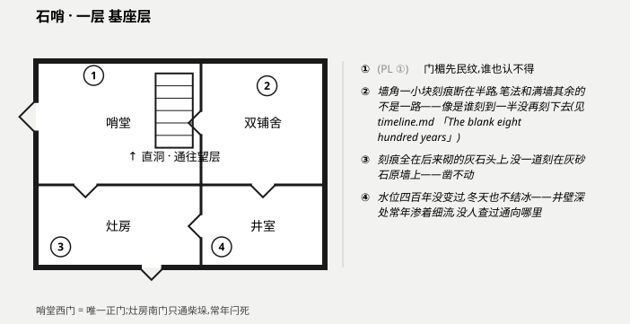
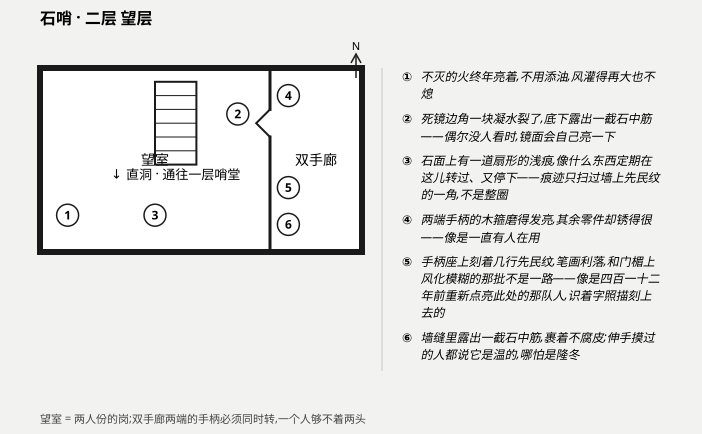

# Location — 石哨

*北脊上一座灰扑扑的方塔,四百一十二年来永远有两个人一组、日夜不空地守着它——没人记得为什么要「看」。*

- **Region / campaign:** [树线之外](../overview.md) · 北脊(韦尔加谷以北,步行约半天,全程上坡)
- **Era feel:** `dark-ages`——欧洲黑暗时代的守望塔,人力照明、以物易物、口传交接
- **Tone:** 民俗恐怖,底色宇宙荒凉;冷峻简白,恐怖来自认知,不来自血肉

> *(守秘人提示:本战役队伍规模为二——默认这两位调查员就是被派上来接班的那一对当值者,详见
> 「People」一节。塔本身的每一处布置都是为「必须两个人」这件事服务的:两个铺位、一场交接、
> 一处一个人够不着的机关。)*

## At a glance (say this out loud)

> 半天的爬坡尽头,石哨从雾里立起来:塔身是灰砂石打的,平整得不像谁的手砌的——边太直,棱太齐,
> 连雨水冲了四百年也冲不出一道歪缝。门楣上刻满先民纹,谁也认不得,但没人敢刮。推门进去先闻
> 到一股怪味,像雷雨刚过,可谷里已经三个月没下雨了。塔里终年有一种低低的声音,不高不吵,像是
> 山自己在说话——当值的人叫它「山在念」,听久了就当成谁家的钟摆。二层望室的墙里嵌着一面死镜,
> 照不出人影,却总在没人盯着的时候忽明忽暗一下。

## Layout / areas

石哨是一座塔,分两层;每层一张图,竖着叠放在下面「Map」一节。**塔心有一道直洞**——楼梯笔直
笔直,一级一级凿得比人手能凿的还齐,连接一层与二层,是全塔唯一的垂直通路。

> **KEEPER ONLY——整体结构** 塔的核心(直洞与望室所在的那圈墙)是崩溃前旧世界一座监测中继
> 站残留的钢筋混凝土井道,顶部原本封着一层监测甲板；四百一十二年前重新捡起这份差事的人,
> 绕着这口幸存的井道砌了圈普通田野石作居住层,又在井道顶端围出望室——**灰砂石是原墙,后来
> 加砌的都是普通石头**,守秘人可以用「哪面墙凿得动」来裁定任何强行破拆的检定:凿普通石墙走
> 常规规则,凿灰砂石原墙——凿不动,只能绕。

### 一层 · 基座层

- **哨堂**——表层:进门第一间,石桌一张摆着交班日志,墙角一个终年不熄的火塘,烟从一道细缝
  抽走,怎么也呛不着人。门楣内侧也刻着先民纹,和别处的对不上一路笔迹。可互动细节:交班日志
  本身——一页页往前翻,字迹会在某一处整体换掉,像是换了个人写,又像是换了个时代。

  > **KEEPER ONLY** 这里是原井道外墙与后砌居住层交接的第一间,地面一角比其余地方平滑得多
  > ——那正是原始混凝土地坪露出来的部分,后砌的石板铺在它周围,拼不平也盖不严。火塘吸力异
  > 常稳定,是因为它坐在一处原本的通风竖井井口上,残余的负压气流一直没停。日志笔迹的断层就
  > 卡在四百一十二年前:再往前的记法用词、格式全然不同,像是抄自另一套底本。

- **双铺舍**——表层:两张铺,两口箱笼,墙上钉着挂钩,当值的两人各占一半。满墙是历代当值者
  刻下的记号和名字,密密麻麻,一年一年数得出来,四百一十二年经手的人手远比这个数字本身
  多,一人一道很正常。唯独墙角一小块例外:那里的刻痕断在半路,笔法和满墙其余的不是一路,
  像是谁刻到一半就没再刻下去。所有刻痕(包括那一小块)都刻在后砌的灰石头上,原来那圈灰
  砂石墙上一道都没有,凿不动。

  > **KEEPER ONLY** 这间从旧世界的编制起就是双人宿舍,概念比现在这批人知道的还要古老——
  > 原始设施图纸上它就写着两个床位,不是后人凑巧砌成这样。墙角那一小块断掉的刻痕,就是
  > `timeline.md` →「The blank eight hundred years」里记的那处物证:八百年空白期间一次
  > 未能延续的重启尝试留下的痕迹。本文件不重复裁定它的成因,只确认它刻在这间宿舍的墙角;
  > 满墙其余的常规刻痕单纯是历代当值者的正常记名,不必然指向任何缺口。

- **灶房**——表层:柴垛、干货、一口铁锅,后墙一道闩死的小门通向柴场。搁架的间距出奇均匀,
  像是嵌进了墙壁本来就有的凹槽里,而不是后钉上去的。

  > **KEEPER ONLY** 那排凹槽是原监测甲板下层的设备导轨,四百一十二年前的人把它当现成的架
  > 子用了,没多想。结构上不承重,不是危险点。

- **井室**——表层:一口井,终年不结冰、水位四百年没变过——谷里拿这个当石哨保佑全谷的证据
  之一。井壁深处能听见细流常年渗着,没人查过通向哪里。

  > **KEEPER ONLY** 这口井是中继站原本的冷却回路取水口,残余管路仍在从更深的岩层里导水上
  > 来,流量微弱但从未断过——这就是「水从哪来」的答案,守秘人可以直接这样裁定,不必让玩家
  > 查到源头才能用水。井壁本身结构完好,不是危险点。

### 二层 · 望层

- **望室**——表层:全塔最大的一间,墙里嵌着一面死镜,照不出人影;死镜边角一块凝水裂了,
  底下露出一截石中筋——偶尔,没人盯着看的时候,镜面会自己亮一下。墙角一盏不灭的火,不用
  添油,风灌得再大也不熄。两扇窄窗,一扇朝谷里(能看见韦尔加谷的方向),一扇朝外(朝着长
  林与不生原的方向)——当值的两人一南一北,各看各的窗。地面正中有一道扇形的浅浅痕迹,像
  什么东西定期在这儿转过、又停下;痕迹只扫过墙上先民纹的一角,不是整圈。

  > **KEEPER ONLY** 死镜是原中继站的监测显示屏,大半块早已彻底死了;边角裂开的那块凝水,
  > 其实是屏幕自己的玻璃护盖,不是窗玻璃,石中筋是屏幕背后走线的一截。它偶尔自明,像是背
  > 后仍有极微弱的信号在过一遍。不灭的火是一盏还在通电的指示灯。地面的扇形磨痕来自屏幕后
  > 方一套定向天线基座残留的伺服机构,过去会随目标方位小幅转动;它现在还会不会动、指向
  > 谁,守秘人不必现在裁定,也不该现在裁定——这是本战役刻意留白的问题之一,只给物证,不给
  > 结论。

- **双手廊**——表层:望室右手一道窄长的廊,两端各有一副木箍手柄,中间一根铁轴贯通全长。
  谷里都知道规矩:交班时两人得同时握住两端的手柄一起转,转到轴身发出一声闷响才算完成交
  接——这也是「山在念」的调子在交班前后会明显变一下的原因。手柄的木箍磨得发亮,轴身其余
  部分却锈得很,像是唯独这里一直有人在用。手柄座上也刻着几行先民纹,笔画利落,和门楣上模
  糊风化的那批不是一路笔迹,倒像是后来有人识着字、照样描着刻上去的。墙缝里还露出一截石中
  筋,裹着不腐皮,伸手摸过的人都说它是温的,哪怕是隆冬。

  > **KEEPER ONLY** 这是原中继站天线伺服系统的人力备用校位装置——自动机构失灵或对不准时,
  > 靠两端同步摇动手动复位,这也是为什么这道廊必须做得比一个人的臂展还长:两端手柄由同一
  > 根轴驱动,单独一人摇一端会打滑空转,非两人同步不可。这条硬性的「两人一组」不是民俗,
  > 是这台机器的物理限制,四百一十二年前重新上任的那队人(`timeline.md` 记的「凯佛伦一
  > 队」)把它当交班仪式继承了下来,理由早已经没人知道。手柄座上那几行利落的先民纹就是
  > 凯佛伦一队留下的——他们认得字,照原有的补刻了一遍;这与一层双铺舍墙角那处八百年空白
  > 期间、断在半路的另一次尝试,是两次不同的人、不同的时候留下的。墙里那截温热的线束,是
  > 仍有电流通过的电缆——**这同样是留白问题「中继站还在往外传吗」的物证之一,只给「它有
  > 电」这个事实,不给「传给谁」「还在传吗」的结论**,守秘人自行裁定何时、是否揭晓。

## People

- **当值的两人(默认)**——本战役队伍规模为二,**默认这两位调查员就是被派上来接这一班的
  人**。他们要面对的第一件事就是交接仪式本身:双手廊的手柄、日志的签收、一句只有当值者才
  会说的交班话——具体台词与检定留给 `core/04-design-scenario.md`。
- **桑塔·雅罗(Santa Yalo)**——即将卸任的瞭望员之一,守了十一年,寡言,记满一整本「山在
  念」调子变化的私人笔记;她比谁都清楚这声音正在变,却不敢跟谷里人说。
- **沃尔克·班宁(Volk Banning)**——桑塔的搭档,上山才两年,坐不住,是第一个说「死镜最近
  亮得不对」的人;私下已经开始怀疑石哨「看」的东西比谷里人以为的更多,但没人可说。

## Map

**守秘人版,含秘密——不要给玩家看。** 未加 `--player`,按本战役这次的范围只做这一版;不做
家具层。房间 `name` 用的都是谷里的叫法(表层)——石哨的每一间屋子对调查员来说都是能走进去
的普通房间,没有一间的**存在本身**需要瞒着玩家,所以这次没有房间被标 `secret: true`;真正
的功能与物证全部放在标了 `secret: true` 的 `callouts` 里,将来渲染 `--player` 版时会被整条
丢弃,不需要额外准备 `player_name`。共享墙两侧的房间给的是完全相同的端点跨度,靠端点精确
匹配而非邻近判断来对齐减细。

**注释读法:** 图面上只有编号圆圈,注释文字在图右侧那一栏,**斜体的就是 `secret: true`
的那几条**——玩家版会整条丢掉,不要念出来。守秘人版每条非秘密注释后面跟着的灰色
`(PL n)`,是这条注释在玩家版里会拿到的号码(玩家版重排成连续编号,不留空号);目前一层
只有 ① 不是秘密,二层六条全是秘密,所以二层的玩家版是一张没有任何注释的干净图。一层 4 条、
二层 6 条,都在「一张图不超过 8 条」的克制线内。

**一层 · 基座层**(`stone-watch-1f.json` → `stone-watch-1f.svg`):



**二层 · 望层**(`stone-watch-2f.json` → `stone-watch-2f.svg`):



渲染命令(均已执行,退出码 0):

```
python scripts/render-map.py campaigns/beyond-the-treeline/world/stone-watch-1f.json
python scripts/render-map.py campaigns/beyond-the-treeline/world/stone-watch-2f.json
```

## Rumours & hooks

- **真:**「石哨最近'看'到的东西不一样了——山在念的调子变了。」桑塔的私记本能佐证;这是
  这一季最要紧的一条,直接通向「迁徙而来的存在」这条主线。
- **诚实的红鲱鱼:** 谷里人说石哨从没塌过,是因为先民对它念过咒,保它千年不倒。这是谷里
  真心相信、逢人就讲的说法——但塔不塌的原因是原墙本身的结构(灰砂石与骨铁),不是任何咒语;
  顺着这条去找「念咒的人」或「符咒的写法」,只会扑空。
- **半真半假:**「交班时如果两人对不上暗号,塔会认不出你。」确有其事的部分是双手廊的同步交
  接仪式(见上,是真实的机械需要);「塔会认人」这个说法则是后人加的神化解释,机构本身认
  不认人,守秘人自行裁定。

## Clues present

- 交班日志的笔迹在四百一十二年前整体断层 → 指向「这份差事是被重新捡起来的」,以及谷里不
  知道的那段八百年空白。
- 沃尔克新记的「山在念」变调 + 死镜闪烁频率变化 → 指向「迁徙而来的存在」这条主线(细化
  留给 `core/05-event-clock.md`)。
- 日志里一条旧条目提到「树线外那处产业,每隔若干年例行巡查一次」,最近一次记录是四十年前
  → 指向 [继承来的宅邸](inherited-holding.md)(不生原方向,另一份文件)。
- 双手廊磨损的手柄 + 温热的线束(不腐皮裹着的石中筋)+ 补刻的先民纹 → 三条共同指向「中继
  站是否仍在往外传」这一未决问号——**只给物证,不给结论**,留给 `core/04`/`core/05` 处理。

## Hazards / secrets

> **KEEPER ONLY**
>
> - **结构:** 原井道(灰砂石 + 骨铁)完好,四百一十二年没塌过,以后也不会无端塌——凿不
>   动、烧不透。真正会塌的只有后砌的田野石部分(哨堂、双铺舍、灶房、井室与望室的外圈),
>   一场大力破拆或长期失修可以让它们局部垮,不会伤到内部的原墙。
> - **双手廊的机械风险:** 若只有一人硬摇一端手柄,轴身会打滑,可能反弹伤及手腕(轻伤,
>   自行按战斗规则处理);它不会造成永久损伤,只是提醒守秘人「必须两人」这条是玩法层面真实
>   存在的门槛,不是装饰。
> - **升级触发(交接仪式相关):** 若当值的两人未能在交班时刻(日出或日落)一起完成双手廊
>   的同步转动,不灭的火会闪灭一次,随后自行重新亮起——这不是自然现象,是系统在确认「哨位
>   是否空过」。若连续错过两次,死镜的闪烁频率会明显变密。这具体意味着什么、要不要挂到
>   `world/event-clock.md` 的触发表里,守秘人按战役当前的走向自行裁定,本文件不预设结论。
> - **未画进图里的一处:** 双手廊尽头的墙缝比其余地方更深,伸手摸得到再往下的空——没人下
>   去过,连桑塔都不知道有多深。留作开放线索,不建第三层图纸。
> - **两个刻意不解答的问号,本文件全程只给物证:** ①「让它待不下去的那个东西是什么」——
>   石哨没有任何直接物证,只有「变了」这个事实。②「中继站还在往外传吗,传给谁」——物证见
>   双手廊(温热的线束、新近的手柄磨损、望室死镜偶尔的自明)与望室的扇形磨痕(伺服机构曾经
>   或仍在小幅转动),但本文件不判定它现在是否仍在运作、是否仍有人接收。

## Open hooks

- 沃尔克愿意告诉调查员他记下的「死镜」变化,但要他们先替他瞒住桑塔——他怕她会因此提前打
  报告,换他提早下山。
- 交班日志那条「树线外产业例行巡查」的条目,该轮到的这次没人提起过;谁该去巡查?谁忘了?
- 双手廊手柄座上补刻的先民纹,和门楣上的不是一路笔迹——是谁在四百一十二年前重新刻的,
  用的又是哪一种字?
- 谷里人到不生原剜骨铁当营生,却没人剜过石哨自己墙里的骨铁——没人说得清是敬畏,还是别的。
- 双手廊尽头那道摸得到更深处的墙缝,没人下去过;要不要现在打开它,是留给桌上那两位的
  决定。

## Links

- [树线之外 — Overview](../overview.md)
- [继承来的宅邸](inherited-holding.md)(树线外,不生原方向——由另一处文件负责,可能尚未
  生成)
- [不生原](the-barrens.md)(石哨再往前约一天路程——由另一处文件负责,可能尚未生成)
- [韦尔加谷](velga.md) · [北脊区域](velga-region.md)(村与区域——由另一处文件负责,可能
  尚未生成)
