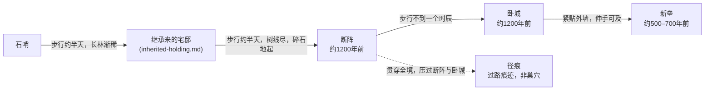

# Location — 不生原

*寸草不生的灰白平原，立着太笔直的石头；风穿过石缝时，像是山自己在说话。*

- **Region / campaign:** [树线之外](../overview.md) · 遗迹带，翻过北脊、穿出长林之后，从
  [石哨](./stone-watch.md)再走约一天。更大的地理关系见 [`velga-region.md`](./velga-region.md)。
- **Era feel:** 黑暗时代实感——没有"废墟考古"这个概念，只有"先民的地界"
- **Tone:** 荒凉、结构性危险、认知眩晕（那不是石头）

## Approach & distances
> 从石哨出发到不生原核心区约一天路程；「继承来的宅邸」正好卡在半途，见
> [`inherited-holding.md`](./inherited-holding.md)。

## At a glance (say this out loud)
> 地面是灰白色的碎石，踩上去发出脆响，像踩在冻硬的雪壳上。风一停，脚步声就成了唯一的
> 声音——没有虫鸣，没有鸟。远处立着一排排四方的灰砂石墩子，间距分毫不差，像是巨人插下
> 的筷子，顶上什么都没有，只留断口。空气里有股烧过的石灰味，混着铁锈。走远了回头看，
> 来路已经和别处长得一模一样。

## Why nothing grows

不生原的"不生"不是诅咒，是地面本身——但一个黑暗时代的人只看得到现象，看不出为什么。

表层能看到的：灰白色的碎石一层压一层，脚下从不陷，没有黑土；偶尔有草根从裂缝里钻
出来，枯死的比活的多；剜过骨铁的断口边缘，寸草不生的范围比别处更大——谷里的说法是
"先民诅咒了自己的坟"。

> **KEEPER ONLY** —— 这片地表下没有真正的土壤层。原本是一整片浇筑混凝土地基与铺装
> 路面（广场、场地、连接建筑之间的硬化地面），八百年的冻融循环把表层震裂成碎石，但碎石
> 之下仍是压实的骨料垫层与残留基础，从未发育出腐殖土。裂缝里析出的石灰（碳酸钙）让局部
> 土壤偏碱，能扎根的植物本就不多。剜骨铁的人每次凿开断口都会把新的石灰粉尘和碎石翻到
> 表面，局部区域因此比别处更贫瘠——这是他们自己造成的，但没人往这个方向想。少数区域
> （尤其"新垒"周边）还残留地下油罐或变压器渗漏的痕迹，土壤里混了别的东西，连耐碱的
> 杂草都活不下去；守秘人可以把这一小片格外死寂的地方当场景标记，暗示这里曾经出过事，
> 不必解释是什么。

## Two ages, mistaken for one

> **KEEPER ONLY** —— 不生原上至少有两批遗物，年代相差近五百年，但谷里（以及大多数调
> 查员的第一直觉）会把它们当成同一批"先民"的手笔。这是本战役最好用的认知陷阱之一，请
> 按下面的落点使用：
>
> - **约一千两百年前（崩溃本身）**——"断阵"与"卧城"主体。机器浇筑，间距、角度分毫不
>   差，先民纹是印刷体，笔画粗细均匀。这是原本那套设施的核心建筑。
> - **约五百至七百年前（八百年空白期内，具体时间点故意不定）**——"新垒"。干垒石块，
>   没有灰砂石那种整体浇筑感，先民纹（这批是手刻的）歪斜、深浅不一，甚至同一面墙上笔迹
>   都不统一，像是好几个人分头刻的。这批建造者是谁，连谷里都不知道——他们**不是**韦尔
>   加谷现在这批人的祖先；守望制度是四百一十二年前才被重新捡起来的，中间那段空白完全
>   没有记录。
> - **落点建议：** 先让调查员注意到两批先民纹"风格不一样"——这是可以靠侦查或考古/历史
>   类检定发现的表层差异，不需要揭穿年代本身。但谷里的历法根本没有"分层"这个概念，任何
>   一个谷民向导都只会把风格差异解释成"不同的先民匠人手艺有高低"。一名真正细心的调查员
>   还能发现新垒的石块**直接拆用了断阵的旧构件**——有人在崩溃很久之后，来到这里，用先
>   民自己的骨头搭了个窝。这比"存在两个年代"这个事实本身更瘆人：说明那八百年的空白里，
>   确实有人在这里活过，而且知道怎么拆解先民的东西。

## Layout / areas

### 断阵（the broken array）
表层：一排排方形石墩，顶上齐齐断口，像是被齐根削掉的树。石墩之间的间距、朝向分毫不
差，雾大的时候只看得见眼前三五根，回头已经认不出方向。断口处能看见几缕包着软皮的细
铁——骨铁客管这个叫"石中筋"，比骨铁本身细，不值钱，没人费力气去剜。

> **KEEPER ONLY** —— 这是一条输电／微波中继走廊的塔基阵列，原本每根立着一座铁塔，
> 连接更深处的设施与石哨。塔身本身早被剜光当骨铁用了，只剩混凝土基座。露出的"石中筋"
> 是残余电缆，已经不导电、不供能。**年代：约一千两百年前。**

### 卧城（the recumbent city）
表层：一片矮下去的建筑群，屋顶塌成了地面的一部分，墙根还立着。这是骨铁最好剜的地方，
断墙里到处是需要凿开才能取出来的骨铁。地面上有几处方方正正的黑洞，往下望是彻底的
黑——本地人叫它"直洞"，说是先民的井，谁也不下去。墙上嵌着几块"死镜"——照不出人脸的
黑镜子，边缘和墙面齐平，像是特意嵌进去的。

> **KEEPER ONLY** —— 这是原设施的办公／宿舍／设备综合体，地下由检修管廊互相连通
> （"直洞"里有的是楼梯间，有的是竖井）。管廊多处坍塌或积水，是不生原最主要的骨铁产
> 地，也是最危险的区域（见 Hazards）。"死镜"是嵌墙显示屏，早已断电。**年代：约一千
> 两百年前的主体建筑；边缘与"新垒"直接相邻，见下。**

### 新垒（the new works）
表层：紧贴着卧城外墙，一圈明显更矮、更糙的石头墙——不是一整块浇出来的，是一块一块干
垒起来的，缝隙里没有灰浆。墙面上也刻着先民纹，但笔画歪斜，深浅不一，和卧城墙上那种笔
直均匀的完全不像。地上散落着几块不腐皮碎片，还有一小截骨头，风化得很白。

> **KEEPER ONLY** —— 后来者（时间点在崩溃后约五百至七百年，即八百年空白期内的某个未
> 知时间）就地取材搭建的营地或哨所，部分石料直接拆自"断阵"的塔基。这批建造者身份不
> 明——**不是**谷里现在这批人的祖先（见"Two ages"一节）。散落的骨头不属于任何一个已知
> 谷民家族——若调查员做医学／法医方向的检定，能看出磨损方式与本地饮食习惯不同。守秘人
> 可以把这具骨头当成"迁徙路线曾经带走过什么"的物证，不必解释是谁、是什么。构造粗糙，
> 是本区一处结构性危险（见 Hazards）。

### 径痕（the track-mark）
表层：一道笔直的凹痕，贯穿断阵与卧城，毫不理会挡在路上的石墙——该塌的塌了，该断的断
了，像是有什么极重的东西压过去，又像是被什么东西犁开的。痕迹边缘的碎石格外干净，不积
灰。踩在痕迹正中央，脚下的凉意比别处更深，风声也弱了一截，仿佛这一条线把"山在念"的声
音吸走了。骨铁客对这条线绕道走，谁也说不清是老规矩还是自己怕。

> **KEEPER ONLY** —— 这不是巢穴，是**过路痕迹**：某个体型巨大的存在（具体形态见
> `core/07-create-monster.md`，本文件不定死）沿这条线经过，不止一次——痕迹有新有旧，
> 新的一道压在旧的之上，角度略有偏差。它对结构毫无兴趣，该压塌的东西就塌了，没有绕开
> 的迹象，也没有停留的迹象——**没有巢、没有食物残渣堆积、没有窝**。这条线大致指向石哨
> 与更远处（"它原来待不下去的地方"与"石哨还在往外传吗"均不在本文件回答范围）。下一节
> 那条不许剜骨铁的"禁令"，其实就是这条线的经验总结，只是被谷里传成了别的故事。

## The bone-iron trade

谷里的锻匠靠"剜"骨铁重锻打铁，不生原是这条经济链唯一的上游。

- **谁来剜：** 谷里派出的骨铁客（通常两三人一队，携带绳索与撬棍），行前要在石哨报备
  路线与预计返程时间——石哨当值的两人是唯一知道"谁进了原、什么时候该回来"的人。
- **怎么剜：** 骨铁咬死在灰砂石里，硬凿凿不动；惯常做法是先浇水，趁夜里结冰撑裂石
  缝，再用撬棍把断口一点点起开。卧城的断墙最好剜——石头本就碎了，骨铁裸露在外。断阵
  的塔基几乎被剜空，新来的骨铁客得往更深处走才有收成。
- **不许剜的地方：** 径痕沿线与两侧约百步之内，谷里的说法是"先民的坟，惊了要遭
  报应"。
  > **KEEPER ONLY** —— 这条禁令是真的有用，但理由是编的。径痕沿线的结构被反复碾压，
  > 比别处更容易毫无预兆地整体垮塌；老骨铁客几代人试出来的"别在那条线上敲石头"的经
  > 验，被后人包装成了"先民的坟"。禁令本身该守，守秘人可以让一名不信邪、执意在径痕附
  > 近凿石头的调查员踩中 Hazards 一节里"卧城"或"新垒"式的坍塌，而不必揭穿禁令的真
  > 假——那是留给玩桌自己发现的。

## People

不生原没有常住者——这正是它区别于韦尔加谷与石哨的地方。会在这里出现的都是路过的人：
受石哨批准出发的骨铁客队伍、极少数带路的猎人，以及（理论上）沿径痕经过的那个东西。尚
未有专属驻留 NPC；若某场戏需要一位向导或队长，建议交给 `core/06-create-npc.md` 现做，
人选可以是谷里锻匠行会派出的领队。

## Rumours & hooks

- **真传闻：** 有经验的骨铁客都知道，卧城墙上嵌的"死镜"如果拿灯凑近了照，偶尔能照出
  一点模糊的影子——不是照的人自己。**这是真的。**
  > **KEEPER ONLY** —— 死镜（嵌墙显示屏）偶有一点微弱的残余供电，能亮起零星像素；谷
  > 里没人知道那是什么，都当成"先民的眼睛还在看"。
- **诚实的红鲱鱼：** 上一辈的骨铁客回来说，断阵深处能听见"有人在数数"——一种规律的、
  间隔均匀的轻响，听起来很像是活物的动静。
  > **KEEPER ONLY** —— 其实是残余供电的死镜偶尔通电时的轻微放电爆裂声，和径痕、和那
  > 个"迁徙而来的东西"毫无关系。守秘人可以让调查员认真查下去，最后一无所获也没关
  > 系——这就是它存在的意义。
- 一件在集市那个从不收摊的摊位上出现的物件，据称"来自原深处"——具体是什么、谁带出来
  的，留给设计场景时决定。
- 某支骨铁客队伍最近全体拒绝再靠近径痕的一段，说不清理由，只说"数目不对"。
- 一块"新垒"的先民纹拓片，如果找到懂旧先民纹的人对照，会发现刻的根本是两种不同的字
  体——第一个意识到这一点的调查员，该往哪查？

## Clues present

- 新垒石块直接拆自断阵塔基 → 指向"八百年空白期确有人到过这里"，不指向威胁本身
- 径痕新旧叠压、角度偏移 → 指向"这不是第一次经过"，为后续场次的时间线埋伏笔
- 死镜偶尔亮起的残影 → 指向石哨"还在传吗"的问号，本文件不解答
- 新垒骨头的磨损方式 → 指向"迁徙路线上带走过什么"，同样不解答是谁、是什么

## Hazards / secrets

> **KEEPER ONLY** —— 不生原的危险全部是结构性的，没有一条能靠单次掷骰直接致命；每条
> 都有一个玩家可以主动发现的预警。
>
> 1. **卧城：直洞塌陷。** 部分管廊入口只剩一层薄碎石盖着空洞。预警：脚下的碎石听起来
>    "发空"、地面异常平整（没有正常碎石该有的起伏）。误踩的后果是摔进一段短距离的竖井
>    或管廊，造成伤害并可能受困，不是当场致死；救援／自救靠体格或攀爬类检定，给足回合
>    数，不是一次定生死。
> 2. **卧城：管廊积水。** 部分地下通道常年积水，黑暗、狭窄，看不见水下有没有落脚点。
>    预警：洞口有滴水声，墙上有一圈圈深浅不一的水痕（过去水位留下的），空气比别处更冷
>    更潮。危险是溺水／失温，不是"水里有东西"——给足脱离时间，不做一次检定失败即溺毙
>    的设计。
> 3. **断阵：迷路失温。** 石墩间距、外观完全一致，起雾时极易失去方向；不生原范围极
>    大，没有任何天然地标。预警：老骨铁客的习惯是入口处系一根绳、沿途留标记，谷里代代
>    相传"雾起就往回走"；没有防范的调查员如果坚持深入，危险是迷路后的长时间暴露（失
>    温、体力耗尽），给足以小时计的缓冲，不是瞬间判定。
> 4. **新垒：干垒墙体坍塌。** 与卧城的灰砂石不同，新垒的石块没有整体浇筑，靠堆叠支
>    撑，承重比卧城墙体差得多。预警：墙面能看见明显的错位、松动的碎石堆在墙根，靠近时
>    能听见石块互相摩擦的轻响。危险是局部垮塌造成的钝击伤，不是整面墙同时倒——给一次
>    侦查／聆听检定的机会先听见，再决定要不要靠近。

## Links
- 更大的地理关系（北脊、长林、韦尔加谷）见 `velga-region.md`
- 石哨（遗迹带唯一的补给／联络点）见 `stone-watch.md`
- 「继承来的房产」就卡在通往不生原的路上，见 [`inherited-holding.md`](./inherited-holding.md)
- 威胁的具体形态与升级见 `core/07-create-monster.md`、`world/event-clock.md`（均待建）
