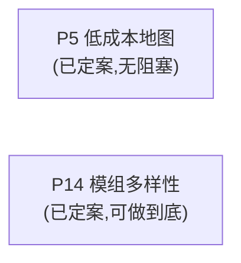

# update_plan/ — Status Tracker

改动计划的索引与执行指引。**执行任何计划前先读本文件**;完成一步就回来更新状态。

## 状态索引

只列**未完成**的计划。已完成并归档的计划不在本表出现,索引见
[Archived/README.md](Archived/README.md)。

| # | 计划 | 范围 | 状态 | 阻塞/等待 |
|---|---|---|---|---|
| P5 | [low-cost-maps](2026-08-02-low-cost-maps.md) | 低成本地图:mermaid 惯例(还债)+ DSL→SVG 渲染器,两个功能——KP 定位图(A 档,已完成)与 PL 可互动场景图(A+B 家具层,待做) | 进行中(阶段 0-1 已完成,阶段 1 `090cd3c`) | **无阻塞**。阶段 0(mermaid 惯例)、阶段 1(`scripts/render-map.py` + DSL 定型 + `templates/location.md`/`scene.md` 接线 + `core/03`/`core/09` 接线)均已完成,原型经结构自查 + Keeper 目测确认「达标」。**阶段 3(ChatGPT 降级路径)2026-08-07 已拍板砍掉,不做**——`core/00` 已写死 kit 只支持有文件系统的 agent。下一步阶段 2(家具层,可选)/ 阶段 2b(室外站点图,可选),两者都不阻塞计划完结,做不做由 Keeper 后续决定 |
| P14 | [scenario-diversity](2026-08-04-scenario-diversity.md) | 模组多样性:`scripts/roll.py` 真伪随机掷骰(不放回 + 跨战役查重)+ 补两张缺表(对抗场面 / 模组形状)+ locations 接到场景级;扩容降为条件执行 | 进行中(阶段 1 已完成并提交,148bb91;阶段 2、阶段 3 已完成,2026-08-07,待提交) | **无阻塞**。阶段 1 已落地:`scripts/roll.py`(两维表、不放回、`--fresh`、非骰表排除名单、自检 + `--check-all`)+ ground rules 新增一条并三适配器同步 + `core/01/03/04/06`、`tables/README.md`、`core/11` 全部改完掷骰点措辞。阶段 2 已落地:种子表口径改对(README 四张改成 hooks/locations/mythos-angles/complications,与 `core/01-intake.md` 一致)+ `locations.md` 接到 `core/04` 第 6 步场景级。阶段 3 已落地:新表 `reference/tables/confrontation-grounds.md`(d20,对抗场面成立的条件)+ `core/04` 第 6/7 步、`core/09`、`tables/README.md` 接线,已通过 `--check-all` 自检。下一步阶段 4(新表 `scenario-shapes.md`,先写 5 条试水) |

**状态取值:** `待讨论(<待定什么>)` / `待执行` / `进行中(<当前所在步骤>)` / `阻塞(<等什么>)` /
`已完成(<commit>)`(完结后移除本表,见完结清单第 7 项)

`待讨论` 用于只摆事实、列选项、提问题,尚未产出 `- [ ]` 执行清单的计划——它没有条目可勾,
定案后先补执行清单再转 `待执行`。

条目级进度看各计划文件内的 `- [ ]` 复选框——本表只跟踪计划级状态,不重复条目。

## 依赖图

P5 与 P14 彼此无依赖,可并行,目前也没有任何计划在等它们。已归档计划(P1–P4、P6、
P9–P13、P15、P16)与它们之间曾经有过的耦合、拍板记录,一律记在
[Archived/README.md](Archived/README.md) 各自条目里,不在这里重复——解决一条依赖边
就删掉它,不留说明段落(见「执行守则」)。

## 建议执行顺序

> **2026-08-04 重排:改为按「损害」排,不再按「可动性/复杂度」排。**
> 旧版把 P10/P5 排在前面(理由是它们最容易动),却又在第 8、9 条的正文里写
> 「P12 优先级高于 P5/P10 剩下的部分」「P14 仅次于 P12」——**编号和正文互相打架,
> 接手会照编号做。** 现在编号即优先级;想按"哪个最好上手"挑活的,看下面的复杂度排序表。
> 已完成的条目不留在本节,见下方一行指路。

**当前没有排队条目。** 剩下能动的都是**可选或非阻塞**的后续阶段——P5 阶段 2/2b(家具层
与室外站点图,可选)、P14 阶段 3–6(新表与收尾,不阻塞任何计划完结)——由 Keeper 按需
再排进本节。

**已完成的历史条目不再在本节列出。** 已归档整份计划(P5 阶段 0/1、P10、P11、P12 阶段
2、P13、P14 阶段 1 等已完成阶段属于此类,当时的落地细节)的范围描述在
[Archived/README.md](Archived/README.md);仍在跑的计划(P5、P14)每个已完成阶段的
细节看各自计划文件里对应小节(该阶段的 `- [ ]` 已勾掉,正文留着怎么做的)。

## 复杂度排序(从简单到复杂)

| # | 计划 | 复杂度 | 工作量实测 | 为什么是这个档 | 现在能动 |
|---|---|---|---|---|---|
| 1 | **P14** 模组多样性 | ★★☆☆☆ | `scripts/roll.py`(**实测 310 行**,估时写的是 ~200:表解析 + 不放回 + 跨战役查重 + 行数自检,外加计划清单之外追加的 `--check-all` 与 `--spec`)+ 两张新 d20 表(共 40 条原创条目)+ `core/00` 一条 ground rule 与三适配器同步 + 5 处掷骰点改措辞 + `core/11` 一条审查项 + 战役新增 `rolls.log` | **2026-08-04 从 ★★★★ 降到 ★★**:原方案「390 条纯创作」被推翻,剩下的主体是一个**当场可验证**的脚本——跑一千次看分布,比任何评审都硬;原创写作只剩 40 条。★ 不高不代表不要紧,它是这批计划里唯一修「现在就在出错」的机制的一条。真风险不在技术在执行:模型会不会真去跑脚本,靠 `rolls.log` 落盘 + `core/11` 判 fail 兜底 | ✅ 全程可动 |
| 2 | **P5** 低成本地图 | ★★★☆☆ | 阶段 0 一份惯例文件 + 两处改引用;阶段 1 新写 `scripts/render-map.py`(A 档,~200 行)+ 原型验证 + 2 个模板 + 2 个 core 各加一行;阶段 2 家具图元 + `--player` 开关;阶段 2b 折线 + 指北针(~20 行) | 唯一要**从零写渲染器**的计划,成品好坏得肉眼看 SVG。**但 2026-08-04 连降两次**:先是 C/D 否决掉材质、阴影与手绘抖动(渲染器变纯确定性);再是照阿卡姆室内图样本发现**家具用几何图元 + 标签就够,不需要图标库**,B 档少掉一半代码和一份会永远增长的美术资产。室外站点图也确认**复用同一渲染器**,不另起炉灶。**阶段 0 单独看只有 ★☆,而且是在还债** | ✅ 已定案,规格有样本可对 |

**读法**:★ 数看的是「一个新窗口从零上手到能提交」的总成本——阅读量、决策量、
文件数、能否当场验证,四项合起来。它和「重要性」无关。

**两条经验**(从本表的形状读出来的):

- **能当场验证的排前面。**
- **待讨论的计划,复杂度看"决策"不看"实现"。**

## 执行守则

- **一次只把一个计划标为"进行中"**,避免半成品互相踩(P1 逐章确认的等待期
  可以插做无依赖项,插做时状态写明:如"进行中(等 Keeper 确认第二章;插做 P6)")
- 每完成计划内一个条目:勾掉该计划文件里的 `- [ ]`
- 每完成一个阶段/整个计划:走一遍下面的**完结清单**
- 收尾在**每个计划完结时**做,不留到最后一起
- 新计划:新建 `YYYY-MM-DD-<slug>.md`,本表加一行,依赖图补节点
- **依赖边解决、计划归档、阶段完成时,依赖图和"建议执行顺序"只删不留痕**——不写
  "为什么删/为什么完成"的说明段落,那类细节的权威副本要么在
  `Archived/README.md`(整个计划归档时),要么在对应计划文件自己已勾掉的 `- [ ]`
  小节里(单个阶段完成、计划还在跑时)。本文件是索引,不是历史记录,本节存在的
  理由就是防止依赖图重新长回一大段历史叙述(2026-08-07 曾经长到 100+ 行才发现)

## 完结清单(Definition of Done)

**每个计划完结时逐条走完再提交。** 漏项的典型后果:归档文件头还写着"待执行"
(2026-08-02 P2 就是这么漏的)、索引与 `reference/` 不同步、README 入口说明过期。

### 1. 状态同步(两处,必须一致)

- [ ] 计划文件头的 `> 状态:` 改成 `**已完成(<commit>)**`,阻塞项写清等什么
- [ ] 本文件状态索引表的「状态」列同步,填 commit hash
- [ ] 计划内所有 `- [ ]` 勾掉;**没做的条目不许勾**——要么写明放弃原因,
      要么拆成新计划并在索引表加行

### 2. Changelog

- [ ] 在根 `CHANGELOG.md` 记一条(格式见该文件顶部)。写**面向 Keeper 的变化**
      ——"现在能做什么/必须怎么做",不是"改了哪个文件哪行"
- [ ] **当天已有条目就补进那一条**(在 `### 修复问题` / `### 更新内容` 下各加一句话、
      标题追加 commit),不要为同一天新开一条
- [ ] 改动影响到根 `README.md` 的入口说明(快速开始、流程图、技能表)时一并更新

### 3. 产物重建

- [ ] 动过 `templates/investigator.schema.json` → 重跑 `scripts/render-investigator.py`
      验证卡面还能渲染
- [ ] 动过 `reference/decks/`、`reference/sourcebooks/`(增删改归档件或其引用出处)→
      重跑 `python scripts/build-reference-index.py`,**必须报 no problems**;
      报「orphaned」说明归档件没接进任何 spec,先接线再提交(见 `core/14-archive-reference.md`)
- [ ] 改动了目录结构、硬约定或计划状态 → 更新 `WORKLOG.md`(给接手会话的上手速览)

### 4. 三适配器一致性

- [ ] 行为改动只落在 `core/`;**根适配器不放独有指令**
- [ ] 确需改适配器时,`CLAUDE.md` / `GEMINI.md` / `AGENTS.md` **三份同步改**
      ——只改一份是 bug,另两个模型不会照做
- [ ] 新增/更名技能:`.claude/skills/<name>/SKILL.md` 与 `CLAUDE.md` 技能表两处都改

### 5. 术语与语言

- [ ] 引入新的规则术语 → 进 `reference/glossary-zh.md`
- [ ] kit 脚手架与文件名保持英文;中文只出现在生成内容与本目录的计划文档

### 6. 计划间关系

- [ ] 本计划**解锁**的下游节点:在依赖图里去掉箭头,被解锁的计划状态从
      `阻塞` 改回 `待执行`
- [ ] 本计划暴露的新问题 → 新建计划文件,别塞进已完结的计划

### 7. 提交与归档

- [ ] commit 信息与 changelog 条目对得上;拿到 hash 后**回填**状态表和计划文件头
      (hash 是提交后才有的,这两处必然是二次提交或 amend)
- [ ] 整个计划(不是单个阶段)完结后,把文件移进 `Archived/`;**本文件状态索引表
      对应行整行删除**(只列未完成的计划),范围描述挪进 `Archived/README.md`
      并加一行索引——细节别留在本文件
- [ ] 提交前 `git status` 确认没有漏掉 `.claude/` 下的联动改动

### 8. 反向扫描(P15 阶段 3 新增)

前七项验的是"本计划要建的建了没";这一项验的是**本计划让哪些既有陈述失效了**——
P9 一个计划就同时踩过"前提失效未回扫"(问题 1)、"临时标记未清"(问题 2)、
"新内容没接线"(问题 4)、"旧段落没对齐"(问题 5)四类漏项,起因都是完结清单从没查过这个方向。

- [ ] `grep` 本计划的编号、计划文件名、`until PN`/`等 PN 定案`一类字样,以及被本计划推翻的
      前提所用的关键名词(例如"没有仓库的 Keeper"这类断言背后的名词)
- [ ] **人工读每一处命中,不看 grep 命中数**——数字达标不代表读懂了,命中里可能有的该改
      生产文件里的失效说法,有的只是历史记录不用动,分不清就都读一遍
- [ ] 本计划自己在生产文件里留下的临时标记(如"待 PN 定案"字样)全部清除或确认已消失

## 已完成归档

计划全部完成后把状态标 `已完成(<commit>)`,移动至 `update_plan/Archived/`,
作为设计决定的记录(各计划内含"为什么这样做"的备忘)。
**归档不等于完结**——先走完上面的完结清单,最后一步才是移动文件。

**归档计划的范围描述、设计理由等细节记在 [`Archived/README.md`](Archived/README.md),
不在本文件重复。** 本文件的状态索引表**只列未完成的计划**,归档条目整行删除
——理由是归档计划只会越来越多,留着指针行也会让每次读本文件的 token 成本一直涨。
新增归档时,除了走上面的完结清单,还要在 `Archived/README.md` 加一行索引。
