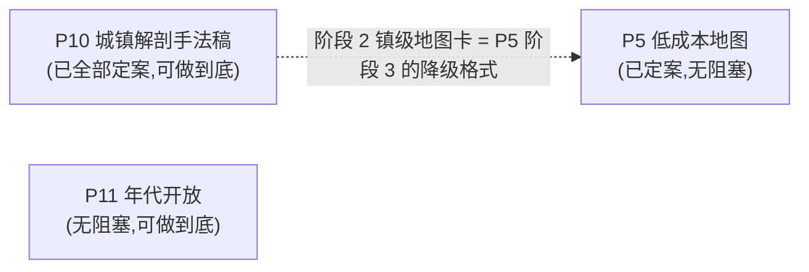

# update_plan/ — Status Tracker

改动计划的索引与执行指引。**执行任何计划前先读本文件**;完成一步就回来更新状态。

## 状态索引

只列**未完成**的计划。已完成并归档的计划不在本表出现,索引见
[Archived/README.md](Archived/README.md)。

| # | 计划 | 范围 | 状态 | 阻塞/等待 |
|---|---|---|---|---|
| P5 | [low-cost-maps](2026-08-02-low-cost-maps.md) | 低成本地图:mermaid 惯例(还债)+ DSL→SVG 渲染器,两个功能——KP 定位图(A 档)与 PL 可互动场景图(A+B 家具层) | 进行中(阶段 0 已完成) | **2026-08-04 三个待拍板问题已全部定案**(C/D 档完全否决);阶段 0 落地 `craft/diagram-conventions-zh.md` 并还清 mermaid 惯例那笔债,**hash 待提交后回填**;下一步阶段 1 原型 |
| P10 | [town-anatomy-from-arkham](2026-08-04-town-anatomy-from-arkham.md) | 阿卡姆资料 → `craft/town-anatomy-zh.md` 城镇解剖手法稿 + `tables/town-institutions.md` d20 机构表 + `craft/diagram-conventions-zh.md` **扩 §六 文字地图卡**(3 张原创样例内嵌) | 进行中(阶段 0 已完成,全部定案,已复评) | **无阻塞**。阶段 0 勘察 2026-08-04 完成(结论见计划内「勘察结果」);当日三个拍板问题全部定案(全文**不**归档——撞硬约定;d20 表**做**;地图卡 3 张、内容全原创)。**同日复评修订六处**(见计划文末「复评记录」):地图卡改为扩 `diagram-conventions-zh.md` §六 而非新建文件、并还掉该文件 §四 一处悬空术语;d20 表剔掉神话层 2 类;阶段 1 新增采料步、§三/§四 换定义。下一步阶段 1.0 采料 |
| P11 | [era-rule-packs](2026-08-04-era-rule-packs.md) | 年代开放:`rules/eras/` 差集包(书里覆盖的全建)+ 战役声明式加载 + 未覆盖年代的推导兜底 + review 串味校验 | 进行中(阶段 0–2 已完成 2026-08-04,**同日复评后新增阶段 2b**) | **无阻塞**。复评发现阶段 2 接线漏三处(见计划文末「复评记录」):`core/13` 绕过年代加载顺序、**路径 B 的 `rules-era.md` 有写无读**、五节体例中英节名不一致,外加 busybodies 卡组在非 1920s 年代的串味限定。**阶段 2b 优先于阶段 3**——阶段 3 的审查项要靠它们才有东西可审。另:整批工作至今未提交 |

**状态取值:** `待讨论(<待定什么>)` / `待执行` / `进行中(<当前所在步骤>)` / `阻塞(<等什么>)` /
`已完成(<commit>)`(完结后移除本表,见完结清单第 7 项)

`待讨论` 用于只摆事实、列选项、提问题,尚未产出 `- [ ]` 执行清单的计划——它没有条目可勾,
定案后先补执行清单再转 `待执行`。

条目级进度看各计划文件内的 `- [ ]` 复选框——本表只跟踪计划级状态,不重复条目。

## 依赖图

P9(怪物强度标尺 + 索引层 + 神格铺设,三阶段)已于 2026-08-04 全部完成并归档,
见 [Archived/README.md](Archived/README.md)。

**2026-08-04 起没有任何计划被完全卡住。** P5 的三个待拍板问题当日全部定案(C/D 档完全
否决);P11 从来没有硬阻塞(目标是年代开放这项**能力**,不是预挑几个年代建包);P10 的
阶段 0 不需要拍板,而且拍板本身就需要勘察结果才答得了——**该阶段与三个拍板问题当日
全部完成,P10 现在也零阻塞**。三条计划彼此无依赖,可并行,唯一的软耦合是 P10 阶段 2 的
镇级地图卡格式正好是 P5 阶段 3 的降级输出格式。**2026-08-04 复评后这条耦合从"格式相同"
变成"同一个文件"**——地图卡直接扩进 P5 阶段 0 产出的 `craft/diagram-conventions-zh.md`
当 §六,P5 阶段 3 不必再跨计划找格式,顺带还掉该文件 §四 的一处悬空术语。
**仍然不构成硬依赖**:两边谁先做都行,先做的那个负责建 §六。

**P1(克苏鲁教团文档整合)已全部完成并归档**(阶段 0-2 见
[`cult-doc-integration`](Archived/2026-08-02-cult-doc-integration.md),阶段 3 收尾见
[`cult-doc-wrapup`](Archived/2026-08-02-cult-doc-wrapup.md),详情见
[Archived/README.md](Archived/README.md))。P9 不是任何硬前置——`core/07` 的占位句
已落盘。

## 建议执行顺序

1. ~~**P11 阶段 1**(给 `character-creation.md` 标上"这是 1920s 基准")~~ —— **已完成
   2026-08-04**。
2. ~~**P11 阶段 0 + 阶段 2**~~ —— **已完成 2026-08-04**:六个年代包已建
   (`reference/rules/eras/`),`eras/README.md` 枢纽文件含未覆盖年代的推导路径。
   **剩下的是阶段 2b(复评补漏四条)+ 阶段 3(review 串味校验)**,2b 先做:
   其中「路径 B 的 delta 有写无读」是断路径,不补的话「年代开放」只落地了一半。
3. ~~**P10 阶段 0**(资料转换与勘察)~~ —— **已完成 2026-08-04**:docx 已转
   `reference/_source/阿卡姆.md`(6723 行 / 14 万字符 / 0 图,结构完整),勘察结论
   连同章节行号表写进了计划的「勘察结果」一节。**决定不切分**——标题体系够规整,
   跳读比切文件便宜。
4. ~~**P10 拍板**~~ —— **三个问题已于 2026-08-04 全部定案**:全文**不**归档(撞
   `core/00` 硬约定,转载放宽只覆盖规则内容,阿卡姆是商业虚构);d20 机构表**做**;
   文字地图卡 **3 张、内容全部原创小镇**。理由见计划的「拍板结果」一节。
5. **P10 阶段 1.0 采料**(读 9 段区导言,只填四维抽象格)→ **阶段 1.1–1.2**(≤100 行
   提炼稿 + `core/03` 两处接线)→ **阶段 2**(d20 机构表 + `diagram-conventions-zh.md`
   扩 §六 与 3 张样例)。两阶段都零阻塞,做完即可归档。
   **阶段 2 里有一条债优先**:`diagram-conventions-zh.md:69` 的「文字地图卡」是个从未
   定义过的裸名词,§六 落地即还清——与 P5 阶段 0 还的是同一类 bug。
6. **P5 阶段 0**(mermaid 惯例落地)——这是**还债不是新功能**:`templates/cult.md` 与
   `craft/cult-design-zh.md` 两个进 bundle 的文件正引用一份不存在的规范,而且指向的是
   不进 bundle 的 `update_plan/`。零阻塞,该优先于 P5 后面几个阶段。
7. **P5 阶段 1**(A 档定位图)——先出原型再定稿惯例,别先写模板。

## 复杂度排序(从简单到复杂)

| # | 计划 | 复杂度 | 工作量实测 | 为什么是这个档 | 现在能动 |
|---|---|---|---|---|---|
| 1 | **P10** 城镇解剖手法稿 | ★★☆☆☆ | 资料 14 万字符 / 6723 行 / 0 图;采料 10 段 + ≤100 行提炼稿 + `core/03` **两处**接线 + d20 机构表 + `diagram-conventions-zh.md` 扩一节与 3 张样例 | 产出本身小(照 `lovecraft-zh.md` 先例)。**2026-08-04 降一档并升到本表第一**:阶段 0 完成后发现资料自带标题体系,提炼 §一只要读 9 段区导言、不必碰 300 个地点条目;同日三个拍板问题全部定案,其中"归档全文"被硬约定直接否掉,反而少一份活。**同日复评后仍是 ★★**,但工作量重新分布了:地图卡改成扩既有文件(少一个新文件),而 d20 表比原估贵——"分类学现成"只覆盖 20 行中的 8 行,另 12 行要把 163 条「各行各业」重做子分类。难点仍是"取手法不取文字"的边界,挡法已写死进阶段 1 与阶段 2 | ✅ 全程可动 |
| 2 | **P11** 年代开放 | ★★★☆☆ | 资料 52 页 / 4 图;1 个基准声明 + 全部年代 delta + `eras/README.md` 枢纽 + `core/01`/`core/02`/`core/11` 三处接线 | 资料小、约定干净(规则内容可转录),**且没有阻塞项**。难点不在建包(几页一个年代),在 `eras/README.md` 要把「差集写法」定得够死——书里没有的年代靠它现场推导 | ✅ 全程可动 |
| 3 | **P5** 低成本地图 | ★★★☆☆ | 阶段 0 一份惯例文件 + 两处改引用;阶段 1 新写 `scripts/render-map.py`(A 档,~200 行)+ 原型验证 + 2 个模板 + 2 个 core 各加一行;阶段 2 家具图元 + `--player` 开关;阶段 2b 折线 + 指北针(~20 行) | 唯一要**从零写渲染器**的计划,成品好坏得肉眼看 SVG。**但 2026-08-04 连降两次**:先是 C/D 否决掉材质、阴影与手绘抖动(渲染器变纯确定性);再是照阿卡姆室内图样本发现**家具用几何图元 + 标签就够,不需要图标库**,B 档少掉一半代码和一份会永远增长的美术资产。室外站点图也确认**复用同一渲染器**,不另起炉灶。**阶段 0 单独看只有 ★☆,而且是在还债** | ✅ 已定案,规格有样本可对 |

**读法**:★ 数看的是「一个新窗口从零上手到能提交」的总成本——阅读量、决策量、
文件数、能否当场验证,四项合起来。它和「重要性」无关。

**两条经验**(从本表的形状读出来的):

- **能当场验证的排前面。**
- **待讨论的计划,复杂度看"决策"不看"实现"。** 

## 执行守则

- **一次只把一个计划标为"进行中"**,避免半成品互相踩(P1 逐章确认的等待期
  可以插做无依赖项,插做时状态写明:如"进行中(等 Keeper 确认第二章;插做 P6)")
- 每完成计划内一个条目:勾掉该计划文件里的 `- [ ]`
- 每完成一个阶段/整个计划:走一遍下面的**完结清单**
- 收尾在**每个计划完结时**做,不留到最后一起
- 新计划:新建 `YYYY-MM-DD-<slug>.md`,本表加一行,依赖图补节点

## 完结清单(Definition of Done)

**每个计划完结时逐条走完再提交。** 漏项的典型后果:归档文件头还写着"待执行"
(2026-08-02 P2 就是这么漏的)、索引与 `reference/` 不同步、README 入口说明过期。

### 1. 状态同步(两处,必须一致)

- [ ] 计划文件头的 `> 状态:` 改成 `**已完成(<commit>)**`,阻塞项写清等什么
- [ ] 本文件状态索引表的「状态」列同步,填 commit hash
- [ ] 计划内所有 `- [ ]` 勾掉;**没做的条目不许勾**——要么写明放弃原因,
      要么拆成新计划并在索引表加行

### 2. Changelog

- [ ] 在根 `CHANGELOG.md` 记一条(格式见该文件顶部)。写**面向 Keeper 的变化**
      ——"现在能做什么/必须怎么做",不是"改了哪个文件哪行"
- [ ] **当天已有条目就补进那一条**(在 `### 修复问题` / `### 更新内容` 下各加一句话、
      标题追加 commit),不要为同一天新开一条
- [ ] 改动影响到根 `README.md` 的入口说明(快速开始、流程图、技能表)时一并更新

### 3. 产物重建

- [ ] 动过 `templates/investigator.schema.json` → 重跑 `scripts/render-investigator.py`
      验证卡面还能渲染
- [ ] 动过 `reference/decks/`、`reference/sourcebooks/`(增删改归档件或其引用出处)→
      重跑 `python scripts/build-reference-index.py`,**必须报 no problems**;
      报「orphaned」说明归档件没接进任何 spec,先接线再提交(见 `core/14-archive-reference.md`)
- [ ] 改动了目录结构、硬约定或计划状态 → 更新 `WORKLOG.md`(给接手会话的上手速览)

### 4. 三适配器一致性

- [ ] 行为改动只落在 `core/`;**根适配器不放独有指令**
- [ ] 确需改适配器时,`CLAUDE.md` / `GEMINI.md` / `AGENTS.md` **三份同步改**
      ——只改一份是 bug,另两个模型不会照做
- [ ] 新增/更名技能:`.claude/skills/<name>/SKILL.md` 与 `CLAUDE.md` 技能表两处都改

### 5. 术语与语言

- [ ] 引入新的规则术语 → 进 `reference/glossary-zh.md`
- [ ] kit 脚手架与文件名保持英文;中文只出现在生成内容与本目录的计划文档

### 6. 计划间关系

- [ ] 本计划**解锁**的下游节点:在依赖图里去掉箭头,被解锁的计划状态从
      `阻塞` 改回 `待执行`
- [ ] 本计划暴露的新问题 → 新建计划文件,别塞进已完结的计划

### 7. 提交与归档

- [ ] commit 信息与 changelog 条目对得上;拿到 hash 后**回填**状态表和计划文件头
      (hash 是提交后才有的,这两处必然是二次提交或 amend)
- [ ] 整个计划(不是单个阶段)完结后,把文件移进 `Archived/`;**本文件状态索引表
      对应行整行删除**(只列未完成的计划),范围描述挪进 `Archived/README.md`
      并加一行索引——细节别留在本文件
- [ ] 提交前 `git status` 确认没有漏掉 `dist/` 或 `.claude/` 下的联动改动

## 已完成归档

计划全部完成后把状态标 `已完成(<commit>)`,移动至 `update_plan/Archived/`,
作为设计决定的记录(各计划内含"为什么这样做"的备忘)。
**归档不等于完结**——先走完上面的完结清单,最后一步才是移动文件。

**归档计划的范围描述、设计理由等细节记在 [`Archived/README.md`](Archived/README.md),
不在本文件重复。** 本文件的状态索引表**只列未完成的计划**,归档条目整行删除
——理由是归档计划只会越来越多,留着指针行也会让每次读本文件的 token 成本一直涨。
新增归档时,除了走上面的完结清单,还要在 `Archived/README.md` 加一行索引。
