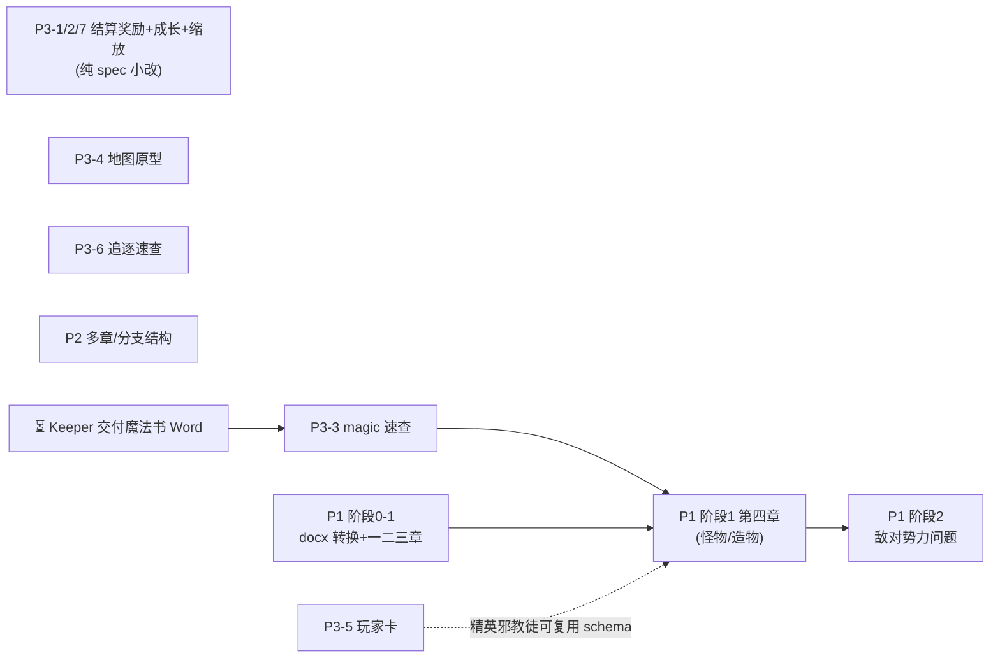

# update_plan/ — Status Tracker

改动计划的索引与执行指引。**执行任何计划前先读本文件**;完成一步就回来更新状态。

## 状态索引

| # | 计划 | 范围 | 状态 | 阻塞/等待 |
|---|---|---|---|---|
| P1 | [cult-doc-integration](2026-08-02-cult-doc-integration.md) | 克苏鲁教团 docx 四章提炼进 kit + 敌对势力 intake 问题 | 待执行 | 源 docx 已确认在 Desktop;第四章含法术时依赖 P3-3(magic 速查) |
| P2 | [multi-arc-and-branching](Archived/2026-08-02-multi-arc-and-branching.md) | 多章 campaign(续作/时间跳跃)与平行世界分支的结构惯例 | 已完成(e0d026b) | 无 |
| P3 | [conventions-gaps](2026-08-02-conventions-gaps.md) | 七项出版惯例缺口:结算奖励、成长阶段、魔法速查、低成本地图、玩家卡、追逐速查、人数缩放 | 进行中(1/2/5/6/7 已完成;4 原型已做,等 Keeper 确认视觉风格/DSL 范围;3 阻塞) | P3-3 等 Keeper 交付魔法书转换稿(仅有原始 PDF,未见转换稿) |

**状态取值:** `待执行` / `进行中(<当前所在步骤>)` / `阻塞(<等什么>)` / `已完成(<commit>)`

条目级进度看各计划文件内的 `- [ ]` 复选框——本表只跟踪计划级状态,不重复条目。

## 依赖图

无箭头指入的节点(P2、P3-1/2/7、P3-4、P3-6)随时可开工,互相独立。

## 建议执行顺序

1. **P3-1/2/7** — 半小时级纯 spec 小改,先清掉
2. **P1 阶段 0–1 的一、二、三章** — docx 转换 + 逐章提炼(每章需 Keeper 确认,周期长,尽早启动)
3. **P3-5 玩家卡** 与 **P3-6 追逐速查** — 穿插做;P3-5 赶在 P1 第四章前完成更好
4. **P3-3 魔法速查** — Keeper 交付转换稿后立即做(它卡着 P1 第四章)
5. **P1 第四章 → P1 阶段 2(敌对势力问题)** — 依赖链最深,最后收
6. **P2** — 独立,任何空档插入
7. **P3-4 地图** — 原型验证通过后定稿惯例

## 执行守则

- **一次只把一个计划标为"进行中"**,避免半成品互相踩(P1 逐章确认的等待期
  可以插做无依赖项,插做时状态写明:如"进行中(等 Keeper 确认第二章;插做 P3-6)")
- 每完成计划内一个条目:勾掉该计划文件里的 `- [ ]`
- 每完成一个阶段/整个计划:走一遍下面的**完结清单**
- 收尾在**每个计划完结时**做,不留到最后一起
- 新计划:新建 `YYYY-MM-DD-<slug>.md`,本表加一行,依赖图补节点

## 完结清单(Definition of Done)

**每个计划完结时逐条走完再提交。** 漏项的典型后果:归档文件头还写着"待执行"
(2026-08-02 P2 就是这么漏的)、`dist/bundle.md` 与 `core/` 不同步、
ChatGPT 用户拿到旧规则。

### 1. 状态同步(两处,必须一致)

- [ ] 计划文件头的 `> 状态:` 改成 `**已完成(<commit>)**`,阻塞项写清等什么
- [ ] 本文件状态索引表的「状态」列同步,填 commit hash
- [ ] 计划内所有 `- [ ]` 勾掉;**没做的条目不许勾**——要么写明放弃原因,
      要么拆成新计划并在索引表加行

### 2. Changelog

- [ ] 在根 `CHANGELOG.md` 追加一条(格式见该文件顶部)。写**面向 Keeper 的变化**
      ——"现在能做什么/必须怎么做",不是"改了哪个文件哪行"
- [ ] 改动影响到根 `README.md` 的入口说明(快速开始、流程图、技能表)时一并更新

### 3. 产物重建

- [ ] 动过 `core/`、`templates/`、`reference/` → 重跑 `scripts/build-bundle.sh`,
      `dist/bundle.md` 与源文件**同一个 commit** 提交
- [ ] 动过 `templates/investigator.schema.json` → 重跑 `scripts/render-investigator.py`
      验证卡面还能渲染

### 4. 三适配器一致性

- [ ] 行为改动只落在 `core/`;**根适配器不放独有指令**
- [ ] 确需改适配器时,`CLAUDE.md` / `GEMINI.md` / `AGENTS.md` **三份同步改**
      ——只改一份是 bug,另两个模型不会照做
- [ ] 新增/更名技能:`.claude/skills/<name>/SKILL.md` 与 `CLAUDE.md` 技能表两处都改

### 5. 术语与语言

- [ ] 引入新的规则术语 → 进 `reference/glossary-zh.md`
- [ ] kit 脚手架与文件名保持英文;中文只出现在生成内容与本目录的计划文档

### 6. 计划间关系

- [ ] 本计划**解锁**的下游节点:在依赖图里去掉箭头,被解锁的计划状态从
      `阻塞` 改回 `待执行`
- [ ] 本计划暴露的新问题 → 新建计划文件,别塞进已完结的计划

### 7. 提交与归档

- [ ] commit 信息与 changelog 条目对得上;拿到 hash 后**回填**状态表和计划文件头
      (hash 是提交后才有的,这两处必然是二次提交或 amend)
- [ ] 整个计划(不是单个阶段)完结后,把文件移进 `Archived/`,
      并把状态表里的链接路径改成 `Archived/...`
- [ ] 提交前 `git status` 确认没有漏掉 `dist/` 或 `.claude/` 下的联动改动

## 已完成归档

计划全部完成后把状态标 `已完成(<commit>)`,移动至 `update_plan/Archived/`,
作为设计决定的记录(各计划内含"为什么这样做"的备忘)。
**归档不等于完结**——先走完上面的完结清单,最后一步才是移动文件。
