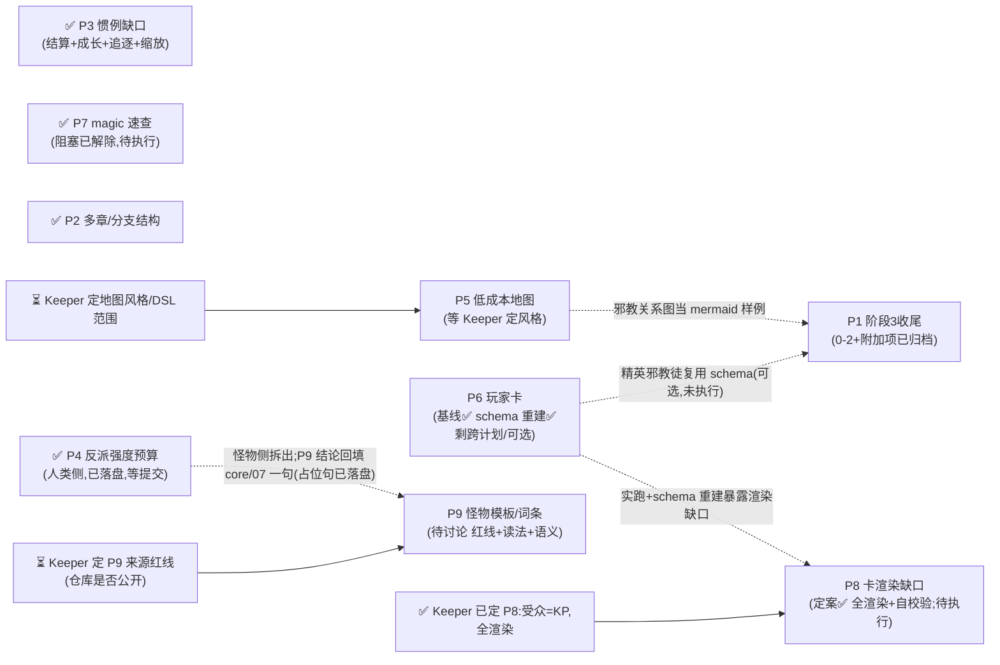

# update_plan/ — Status Tracker

改动计划的索引与执行指引。**执行任何计划前先读本文件**;完成一步就回来更新状态。

## 状态索引

| # | 计划 | 范围 | 状态 | 阻塞/等待 |
|---|---|---|---|---|
| P1 | [cult-doc-wrapup](2026-08-02-cult-doc-wrapup.md) | 克苏鲁教团文档整合的阶段 3 收尾(索引登记、review-material 审计、提交)。阶段 0/1/2 与附加项已完成并归档,详情见 [Archived/README.md](Archived/README.md) | 待执行 | 无——纯收尾工作量,无外部依赖 |
| P2 | [multi-arc-and-branching](Archived/2026-08-02-multi-arc-and-branching.md) | 已归档,详情见 [Archived/README.md](Archived/README.md) | 已完成(e0d026b) | 无 |
| P3 | [conventions-gaps](Archived/2026-08-02-conventions-gaps.md) | 已归档,详情见 [Archived/README.md](Archived/README.md) | 已完成(e0d026b) | 无 |
| P4 | [antagonist-budget](2026-08-02-antagonist-budget.md) | 反派强度预算(**仅人类侧**):普通人类模板(取材 busybodies-zh.md,法术型另取材 grand-grimoire-zh.md)+ 增量(法术型走资历法术表 / 非法术型走装备总价)、属性/技能走标准创建规则 + 标准池公式(预算带表已删)、法术数量、NPC SAN、致命性倒推口径 | 进行中(内容已全部落盘到 `character-creation.md` §11 + `core/02/06/07/11` 接线;等提交后回填 commit、走完结清单归档) | 无——九项中 1/2/3/4/5/8/9 已定案并落盘;待讨论 7(阶梯与 type/threat 咬合)已转交 P9,不卡本计划完结 |
| P5 | [low-cost-maps](2026-08-02-low-cost-maps.md) | 低成本地图:mermaid 关系图 + DSL→SVG 平面图渲染器 + 手绘要点清单 | 阻塞(等 Keeper 定视觉风格与 DSL 范围) | 三个待拍板问题见计划文件;原型尚未落盘 |
| P6 | [investigator-cards](2026-08-02-investigator-cards.md) | 玩家卡(投资者):JSON 唯一真源 + md 卡面 + `create-investigator` 技能 | 进行中(基线 e0d026b;第二轮「照真实车卡表重建 schema」已交付;剩跨 P1 复用 1 条 + 可选 1 条) | 跨计划条目等 P1 第四章。schema 已按真实车卡表重建并被 `templates/investigator.example.json` 压过(算术已核);重建暴露的新渲染缺口记入 P8 缺陷 4 |
| P7 | [magic-quickref](2026-08-02-magic-quickref.md) | 魔法速查 `reference/rules/magic.md`:施法通则、tome/spell 数值惯例 | **待执行(阻塞已解除 2026-08-02)** | 转换稿已归档为 `reference/sourcebooks/grand-grimoire-zh.md`(重译后 5366 行);P1 第四章已改为只落盘自身需要的 7 个法术,不再卡它,但完整速查仍待做 |
| P8 | [investigator-render-gaps](2026-08-02-investigator-render-gaps.md) | 投资者卡渲染缺口:`spells`/`cthulhu_mythos`/`notes` 未渲染、`elite-npc` 仍渲 Hooks、P6 重建后新增字段无卡面出口;+自校验 | 待执行(2026-08-02 定案:受众唯一=KP、全渲染;缺陷 2 反转为改 `core/13` spec;自校验纳入,阈值挂 intake;执行清单已补) | 无硬阻塞,可开工;建议在 P1 第四章落盘前完成,免精英卡返工 |
| P9 | [monster-templates-traits](2026-08-02-monster-templates-traits.md) | 怪物侧强度标尺:种类阶梯的档位区间、按 type 分的模板、词条(强化)系统与其存储格式 | 待讨论(五项待定,尚无执行清单) | 从 P4 待讨论 2 拆出。骨架已由 P4 定案 A 给出(`人类<怪物<古神眷族<古神`),本计划填第二层;并接手 P4 待讨论 7(阶梯与 type 六类/threat 四档咬合)。等 Keeper 定来源红线(仓库是否公开 / A/B/C)、"具体模板"读法、词条语义;**不卡 P1 第四章**,只回填 `core/07` 一句。**2026-08-02:红线问题部分有答案了**——转载规则已改(收录须标注出处、产出只取结构不取文字,见 `core/00-how-to-run.md`),且 `reference/sourcebooks/malleus-monstrorum-zh.md` 已在仓库里可读;剩下要定的是"具体模板"的读法与范围 |

**状态取值:** `待讨论(<待定什么>)` / `待执行` / `进行中(<当前所在步骤>)` / `阻塞(<等什么>)` /
`已完成(<commit>)`

`待讨论` 用于只摆事实、列选项、提问题,尚未产出 `- [ ]` 执行清单的计划——它没有条目可勾,
定案后先补执行清单再转 `待执行`。

条目级进度看各计划文件内的 `- [ ]` 复选框——本表只跟踪计划级状态,不重复条目。

## 依赖图

**P1 阶段 0/1/2 与附加项已完成并归档**(见 [Archived/README.md](Archived/README.md))
——第四章(邪教徒/怪物/造物)只用了自身需要的 7 个新法术,没有等 P7 的完整速查;
阶段 2(敌对势力 intake 问题、campaign `Threat` 字段)也已接线完毕。剩下的阶段 3 收尾
(README 登记、review-material 审计、归档)拆成独立计划
[`2026-08-02-cult-doc-wrapup.md`](2026-08-02-cult-doc-wrapup.md) 继续跟踪。
P8 已定案待执行;P9 也不是任何硬前置——`core/07` 的占位句已落盘。
活动计划中仍在等 Keeper 的只剩 P5(风格/范围)、P9(范围)。

## 建议执行顺序

~~P2 多章/分支~~ ~~P3 惯例缺口(结算+成长+追逐+缩放)~~ ~~P4 反派强度预算(人类侧)~~
~~P1 阶段 0/1/2 + 附加项~~ —— 已完成/已落盘。剩下的:

1. **P1 阶段 3(收尾)** —— 已拆成独立计划 [`2026-08-02-cult-doc-wrapup.md`](2026-08-02-cult-doc-wrapup.md):
   README 登记、review-material 审计、提交,纯收尾工作量,无外部依赖
2. **P7 魔法速查** — 阻塞已解除(转换稿已归档);P1 第四章已经不再等它,纯工作量
3. **P8 卡渲染缺口** — 已定案(全渲染+自校验),建议赶在 P1 第四章的精英卡满卡化
   (`character-creation.md` §11 之外还没做的部分)之前做完,否则精英卡要返工重渲
4. **P6 玩家卡收尾** — schema 已按真实车卡表重建并被样卡压过,只剩 `roster.csv` 做或弃
   的一句话决定,不必单独排期
5. **P5 地图** — 等 Keeper 定视觉风格/DSL 范围后定稿惯例;若 Keeper 用手绘,
   可只保留 mermaid 一档、砍掉渲染器
6. **P9 怪物模板/词条** — 排最后。第一问(来源红线)已部分有答案(转载规则已改、
   malleus 重译稿可读),剩"具体模板"的读法与范围待 Keeper 定;在那之前不动手,
   它不卡任何人

## 复杂度排序(从简单到复杂)

上面的「建议执行顺序」按**依赖**排,本表按**工作量**排。**新开窗口从本表第 1 条往下挑**——
挑第一个「现在能动」为「是」的,能在一个上下文里做完并走完完结清单,不必先加载整条依赖链。

~~P4 反派强度预算~~ —— 已完成(人类侧,2026-08-02 第五轮),移出本表。剩下的:

| # | 计划 | 复杂度 | 工作量实测 | 为什么是这个档 | 现在能动 |
|---|---|---|---|---|---|
| 1 | **P6** 玩家卡收尾 | ★☆☆☆☆ | 剩 2 条:1 条跨 P1、1 条可选(`roster.csv`) | 无待讨论、无红线。第二轮(照真实车卡表重建 schema)已做完,剩下的只有**账务对齐**:`roster.csv` 决定做或弃 | ✅ 是 |
| 2 | **P8** 卡渲染缺口 | ★★☆☆☆ | 3 个已实测确认的缺陷(1/2/4)+ 自校验,触及 2 个文件(`render-investigator.py` + `templates/investigator.md`)+ `core/13`/`core/01` 各一处 | 诊断已完成、修法已定案(全渲染,不分受众;缺陷 2 改 spec 不改脚本)。本机有 Python 3.14.5,改完能立刻实跑验证——**唯一一个改完能当场证明对错的计划** | ✅ 是(2026-08-02 已定案) |
| 3 | **P9** 怪物模板/词条 | ★★★☆☆ | 1–3 个文件(骨架升级)**或** 几十个文件(原型库),差一个数量级 | 复杂度**不在实现在决策**:范围本身未定,且第一问是版权红线(能不能做)。定完 1/2/3 后若走"骨架 + 词条表",实际工作量掉到 ★★ | ❌ 等红线定案 |
| 4 | **P7** 魔法速查 | ★★★☆☆ | 1 个新 `reference/rules/magic.md` + 4 处登记 + 重跑 bundle | 每一步都机械,但**输入是一整本魔法书**——通读切块 + 逐条重写(不得转录)的阅读量是本表最大的单项。**阻塞已解除**(转换稿已归档),现在是纯工作量,不再等 Keeper | ✅ 是(阻塞已解除) |
| 5 | **P5** 低成本地图 | ★★★★☆ | 新写 `scripts/render-map.py` + 原型验证 + 2 个模板 + 2 个 core 各加一行 | 唯一要**从零写渲染器**的计划,且成品好坏得肉眼看 SVG 才知道,迭代成本高。视觉风格没定就写等于白写。**若 Keeper 砍掉 DSL 只留 mermaid,它立刻掉到 ★☆** | ❌ 等风格/范围定案 |
| 6 | **P1** 教团文档整合(阶段3收尾) | ★☆☆☆☆(降级) | 阶段 0/1/2 与附加项已完成并归档;剩独立计划 [`2026-08-02-cult-doc-wrapup.md`](2026-08-02-cult-doc-wrapup.md) 的收尾清单(README 登记 + review-material 审计 + 提交) | 曾是本表最重的计划(四章提炼),现已做完并归档;剩下的是任何计划完结都要走的标准收尾流程,不是本计划特有的工作量 | ✅ 是 |

**读法**:★ 数看的是「一个新窗口从零上手到能提交」的总成本——阅读量、决策量、
文件数、能否当场验证,四项合起来。它和「重要性」无关:P1 最复杂但也最有价值。

**两条经验**(从本表的形状读出来的):

- **能当场验证的排前面。** P8 改完就能跑脚本看结果,P5 写完渲染器只能肉眼判断 SVG 好不好看——
  同样是写代码,前者的返工风险低一个量级
- **待讨论的计划,复杂度看"决策"不看"实现"。** P9 的实现可能只有 3 个文件,
  但范围没定之前谁也不知道是 3 个还是 40 个;P4 反过来,产物形状清楚,拍板只是选项之间挑一个

## 执行守则

- **一次只把一个计划标为"进行中"**,避免半成品互相踩(P1 逐章确认的等待期
  可以插做无依赖项,插做时状态写明:如"进行中(等 Keeper 确认第二章;插做 P6)")
- 每完成计划内一个条目:勾掉该计划文件里的 `- [ ]`
- 每完成一个阶段/整个计划:走一遍下面的**完结清单**
- 收尾在**每个计划完结时**做,不留到最后一起
- 新计划:新建 `YYYY-MM-DD-<slug>.md`,本表加一行,依赖图补节点

## 完结清单(Definition of Done)

**每个计划完结时逐条走完再提交。** 漏项的典型后果:归档文件头还写着"待执行"
(2026-08-02 P2 就是这么漏的)、`dist/bundle.md` 与 `core/` 不同步、
ChatGPT 用户拿到旧规则。

### 1. 状态同步(两处,必须一致)

- [ ] 计划文件头的 `> 状态:` 改成 `**已完成(<commit>)**`,阻塞项写清等什么
- [ ] 本文件状态索引表的「状态」列同步,填 commit hash
- [ ] 计划内所有 `- [ ]` 勾掉;**没做的条目不许勾**——要么写明放弃原因,
      要么拆成新计划并在索引表加行

### 2. Changelog

- [ ] 在根 `CHANGELOG.md` 记一条(格式见该文件顶部)。写**面向 Keeper 的变化**
      ——"现在能做什么/必须怎么做",不是"改了哪个文件哪行"
- [ ] **当天已有条目就补进那一条**(在 `### 修复问题` / `### 更新内容` 下各加一句话、
      标题追加 commit),不要为同一天新开一条
- [ ] 改动影响到根 `README.md` 的入口说明(快速开始、流程图、技能表)时一并更新

### 3. 产物重建

- [ ] 动过 `core/`、`templates/`、`reference/` → 重跑 `scripts/build-bundle.sh`,
      `dist/bundle.md` 与源文件**同一个 commit** 提交
- [ ] 动过 `templates/investigator.schema.json` → 重跑 `scripts/render-investigator.py`
      验证卡面还能渲染
- [ ] 动过 `reference/decks/`、`reference/sourcebooks/`(增删改归档件或其引用出处)→
      重跑 `python scripts/build-reference-index.py`,**必须报 no problems**;
      报「orphaned」说明归档件没接进任何 spec,先接线再提交(见 `core/14-archive-reference.md`)
- [ ] 改动了目录结构、硬约定或计划状态 → 更新 `WORKLOG.md`(给接手会话的上手速览)

### 4. 三适配器一致性

- [ ] 行为改动只落在 `core/`;**根适配器不放独有指令**
- [ ] 确需改适配器时,`CLAUDE.md` / `GEMINI.md` / `AGENTS.md` **三份同步改**
      ——只改一份是 bug,另两个模型不会照做
- [ ] 新增/更名技能:`.claude/skills/<name>/SKILL.md` 与 `CLAUDE.md` 技能表两处都改

### 5. 术语与语言

- [ ] 引入新的规则术语 → 进 `reference/glossary-zh.md`
- [ ] kit 脚手架与文件名保持英文;中文只出现在生成内容与本目录的计划文档

### 6. 计划间关系

- [ ] 本计划**解锁**的下游节点:在依赖图里去掉箭头,被解锁的计划状态从
      `阻塞` 改回 `待执行`
- [ ] 本计划暴露的新问题 → 新建计划文件,别塞进已完结的计划

### 7. 提交与归档

- [ ] commit 信息与 changelog 条目对得上;拿到 hash 后**回填**状态表和计划文件头
      (hash 是提交后才有的,这两处必然是二次提交或 amend)
- [ ] 整个计划(不是单个阶段)完结后,把文件移进 `Archived/`;本文件状态表对应行
      改成指向 `Archived/...` 的极简指针(链接 + 极简状态),范围描述挪进
      `Archived/README.md` 并加一行索引——细节别留在本文件
- [ ] 提交前 `git status` 确认没有漏掉 `dist/` 或 `.claude/` 下的联动改动

## 已完成归档

计划全部完成后把状态标 `已完成(<commit>)`,移动至 `update_plan/Archived/`,
作为设计决定的记录(各计划内含"为什么这样做"的备忘)。
**归档不等于完结**——先走完上面的完结清单,最后一步才是移动文件。

**归档计划的范围描述、设计理由等细节记在 [`Archived/README.md`](Archived/README.md),
不在本文件重复。** 本文件的状态索引表对归档条目只留一行指针(链接 + 极简状态),
理由是归档计划只会越来越多,细节留在这里会让每次读本文件的 token 成本一直涨。
新增归档时,除了走上面的完结清单,还要在 `Archived/README.md` 加一行索引。
