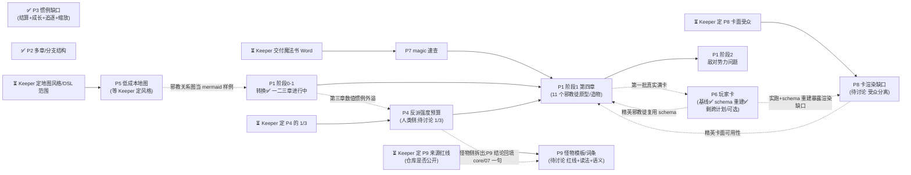

# update_plan/ — Status Tracker

改动计划的索引与执行指引。**执行任何计划前先读本文件**;完成一步就回来更新状态。

## 状态索引

| # | 计划 | 范围 | 状态 | 阻塞/等待 |
|---|---|---|---|---|
| P1 | [cult-doc-integration](2026-08-02-cult-doc-integration.md) | 克苏鲁教团 docx 四章提炼进 kit + 敌对势力 intake 问题 | 进行中(阶段 0 完成;阶段 1 第三章已通读、待落盘) | 第三章数值惯例的去向拆去 P4 待讨论;第四章依赖 P7(magic 速查)与 P4(1/2/3 项) |
| P2 | [multi-arc-and-branching](Archived/2026-08-02-multi-arc-and-branching.md) | 多章 campaign(续作/时间跳跃)与平行世界分支的结构惯例 | 已完成(e0d026b) | 无 |
| P3 | [conventions-gaps](Archived/2026-08-02-conventions-gaps.md) | 七项出版惯例缺口的评估。结算奖励、成长阶段、追逐速查、人数缩放已落盘;魔法速查/地图/玩家卡拆出为 P7/P5/P6 | 已完成(e0d026b) | 无 |
| P4 | [antagonist-budget](2026-08-02-antagonist-budget.md) | 反派强度预算(**仅人类侧**):普通人类模板 + 增量、技能点预算带(降级为审计上限)、法术数量、NPC SAN、致命性倒推口径 | 待讨论(九项中 2、4 已定案;第二轮定案 B 改了主机制:预算带不再是生成方法;尚无执行清单) | 等 Keeper 定归属(1)、预算带定位(3)、致命性口径是否纳入(5)、**普通人类模板基线(8,定案 B 硬前置)**;待讨论 9(生成时提问的落点)挂起等角色创建知识蒸馏;卡着 P1 第四章 |
| P5 | [low-cost-maps](2026-08-02-low-cost-maps.md) | 低成本地图:mermaid 关系图 + DSL→SVG 平面图渲染器 + 手绘要点清单 | 阻塞(等 Keeper 定视觉风格与 DSL 范围) | 三个待拍板问题见计划文件;原型尚未落盘 |
| P6 | [investigator-cards](2026-08-02-investigator-cards.md) | 玩家卡(投资者):JSON 唯一真源 + md 卡面 + `create-investigator` 技能 | 进行中(基线 e0d026b;第二轮「照真实车卡表重建 schema」已交付;剩跨 P1 复用 1 条 + 可选 1 条) | 跨计划条目等 P1 第四章。schema 已按真实车卡表重建并被 `templates/investigator.example.json` 压过(算术已核);重建暴露的新渲染缺口记入 P8 缺陷 4 |
| P7 | [magic-quickref](2026-08-02-magic-quickref.md) | 魔法速查 `reference/rules/magic.md`:施法通则、tome/spell 数值惯例 | **待执行(阻塞已解除 2026-08-02)** | 转换稿已归档为 `reference/sourcebooks/grand-grimoire-zh.md`(13731 行);仍卡着 P1 第四章 |
| P8 | [investigator-render-gaps](2026-08-02-investigator-render-gaps.md) | 投资者卡渲染缺口:`spells`/`cthulhu_mythos`/`notes` 未渲染、`elite-npc` 仍渲 Hooks、P6 重建后新增字段无卡面出口 | 待讨论(缺陷 1/2/4 已实测确认,修法形状等待讨论 1;缺陷 3 已直接修) | 等 Keeper 定卡面受众——P6 重建后受众可能是**三**种(玩家/守秘人/审卡),不止两种;影响 P1 第四章的卡面可用性 |
| P9 | [monster-templates-traits](2026-08-02-monster-templates-traits.md) | 怪物侧强度标尺:种类阶梯的档位区间、按 type 分的模板、词条(强化)系统与其存储格式 | 待讨论(五项待定,尚无执行清单) | 从 P4 待讨论 2 拆出。骨架已由 P4 定案 A 给出(`人类<怪物<古神眷族<古神`),本计划填第二层;并接手 P4 待讨论 7(阶梯与 type 六类/threat 四档咬合)。等 Keeper 定来源红线(仓库是否公开 / A/B/C)、"具体模板"读法、词条语义;**不卡 P1 第四章**,只回填 `core/07` 一句。**2026-08-02:红线问题部分有答案了**——转载规则已改(收录须标注出处、产出只取结构不取文字,见 `core/00-how-to-run.md`),且 `reference/sourcebooks/malleus-monstrorum-zh.md` 已在仓库里可读;剩下要定的是"具体模板"的读法与范围 |

**状态取值:** `待讨论(<待定什么>)` / `待执行` / `进行中(<当前所在步骤>)` / `阻塞(<等什么>)` /
`已完成(<commit>)`

`待讨论` 用于只摆事实、列选项、提问题,尚未产出 `- [ ]` 执行清单的计划——它没有条目可勾,
定案后先补执行清单再转 `待执行`。

条目级进度看各计划文件内的 `- [ ]` 复选框——本表只跟踪计划级状态,不重复条目。

## 依赖图

第四章有**两个**硬前置(P7 魔法速查、P4 反派强度预算),都卡在等 Keeper;
P8 不是硬前置,但第四章的精英卡若在 P8 定案前落盘,渲出的卡会缺法术栏。
P9 也不是硬前置——它只回填 `core/07` 的一句话,人类侧的 P4 不等它。
五个活动计划里有四个(P5、P7、P8、P9)在等 Keeper 拍板或交付,只有 P6 的剩余条目
可以顺手推进。

## 建议执行顺序

~~P2 多章/分支~~ ~~P3 惯例缺口(结算+成长+追逐+缩放)~~ —— 已完成。剩下的:

1. **P1 阶段 1 第三章落盘** — 已通读,把提炼内容写进 kit(数值惯例部分不落这里,归 P4)
2. **P4 待讨论 1/3** — 需要 Keeper 拍板;定完才补执行清单。**它和 P7 一起卡着第四章**
   (待讨论 2 已定案:只管人类侧)
3. **P7 魔法速查** — Keeper 交付转换稿后立即做
4. **P1 第四章 → P1 阶段 2(敌对势力问题)** — 依赖链最深,最后收
5. **P5 地图** — 等 Keeper 定视觉风格/DSL 范围后定稿惯例;若 Keeper 用手绘,
   可只保留 mermaid 一档、砍掉渲染器
6. **P6 玩家卡收尾** — schema 已按真实车卡表重建并被样卡压过,只剩 `roster.csv` 做或弃
   的一句话决定,不必单独排期
7. **P8 卡渲染缺口** — 待讨论 1 需要 Keeper 拍板;定案后与第四章的精英卡一起做,
   否则精英卡要返工重渲
8. **P9 怪物模板/词条** — 排最后。第一问(来源红线)是"能不能做",Keeper 答"仓库公开否 +
   A/B/C"就能解锁;在那之前不动手。它不卡任何人

## 复杂度排序(从简单到复杂)

上面的「建议执行顺序」按**依赖**排,本表按**工作量**排。**新开窗口从本表第 1 条往下挑**——
挑第一个「现在能动」为「是」的,能在一个上下文里做完并走完完结清单,不必先加载整条依赖链。

| # | 计划 | 复杂度 | 工作量实测 | 为什么是这个档 | 现在能动 |
|---|---|---|---|---|---|
| 1 | **P6** 玩家卡收尾 | ★☆☆☆☆ | 剩 2 条:1 条跨 P1、1 条可选(`roster.csv`) | 无待讨论、无红线。第二轮(照真实车卡表重建 schema)已做完,剩下的只有**账务对齐**:`roster.csv` 决定做或弃 | ✅ 是 |
| 2 | **P8** 卡渲染缺口 | ★★☆☆☆ | 2 个已实测确认的缺陷,触及 2 个文件(`render-investigator.py` + `templates/investigator.md`) | 诊断已完成、根因已定位(渲染器不分受众)、修法有推荐项(选 A 按 type 分支)。本机有 Python 3.14.5,改完能立刻实跑验证——**唯一一个改完能当场证明对错的计划** | ⚠️ 等 1 个拍板(A/B/C,倾向 A) |
| 3 | **P4** 反派强度预算 | ★★☆☆☆ | 落 1 个新速查文件 + `core/02` 登记一行 + 可能 `core/11` 加一条 | 产物小且形状清楚。真正的成本在**待讨论 3 的自验算术**(拿 7e 车卡公式重算预算带,不能抄源文档),那是一次性的、有限的 | ⚠️ 等 3 个拍板 |
| 4 | **P9** 怪物模板/词条 | ★★★☆☆ | 1–3 个文件(骨架升级)**或** 几十个文件(原型库),差一个数量级 | 复杂度**不在实现在决策**:范围本身未定,且第一问是版权红线(能不能做)。定完 1/2/3 后若走"骨架 + 词条表",实际工作量掉到 ★★ | ❌ 等红线定案 |
| 5 | **P7** 魔法速查 | ★★★☆☆ | 1 个新 `reference/rules/magic.md` + 4 处登记 + 重跑 bundle | 每一步都机械,但**输入是一整本魔法书**——通读切块 + 逐条重写(不得转录)的阅读量是本表最大的单项。且卡在 Keeper 交付转换稿,零进度可推 | ❌ 等 Keeper 交付 |
| 6 | **P5** 低成本地图 | ★★★★☆ | 新写 `scripts/render-map.py` + 原型验证 + 2 个模板 + 2 个 core 各加一行 | 唯一要**从零写渲染器**的计划,且成品好坏得肉眼看 SVG 才知道,迭代成本高。视觉风格没定就写等于白写。**若 Keeper 砍掉 DSL 只留 mermaid,它立刻掉到 ★☆** | ❌ 等风格/范围定案 |
| 7 | **P1** 教团文档整合 | ★★★★★ | 41 个未勾条目、4 章、跨 `core/`+`reference/tables/`+ intake | 体量是第二名的数倍,且第四章有**两个硬前置**(P4、P7)都没解。只能分章推进,不可能一个窗口做完 | 🟡 部分(第三章落盘可动) |

**读法**:★ 数看的是「一个新窗口从零上手到能提交」的总成本——阅读量、决策量、
文件数、能否当场验证,四项合起来。它和「重要性」无关:P1 最复杂但也最有价值。

**两条经验**(从本表的形状读出来的):

- **能当场验证的排前面。** P8 改完就能跑脚本看结果,P5 写完渲染器只能肉眼判断 SVG 好不好看——
  同样是写代码,前者的返工风险低一个量级
- **待讨论的计划,复杂度看"决策"不看"实现"。** P9 的实现可能只有 3 个文件,
  但范围没定之前谁也不知道是 3 个还是 40 个;P4 反过来,产物形状清楚,拍板只是选项之间挑一个

## 执行守则

- **一次只把一个计划标为"进行中"**,避免半成品互相踩(P1 逐章确认的等待期
  可以插做无依赖项,插做时状态写明:如"进行中(等 Keeper 确认第二章;插做 P6)")
- 每完成计划内一个条目:勾掉该计划文件里的 `- [ ]`
- 每完成一个阶段/整个计划:走一遍下面的**完结清单**
- 收尾在**每个计划完结时**做,不留到最后一起
- 新计划:新建 `YYYY-MM-DD-<slug>.md`,本表加一行,依赖图补节点

## 完结清单(Definition of Done)

**每个计划完结时逐条走完再提交。** 漏项的典型后果:归档文件头还写着"待执行"
(2026-08-02 P2 就是这么漏的)、`dist/bundle.md` 与 `core/` 不同步、
ChatGPT 用户拿到旧规则。

### 1. 状态同步(两处,必须一致)

- [ ] 计划文件头的 `> 状态:` 改成 `**已完成(<commit>)**`,阻塞项写清等什么
- [ ] 本文件状态索引表的「状态」列同步,填 commit hash
- [ ] 计划内所有 `- [ ]` 勾掉;**没做的条目不许勾**——要么写明放弃原因,
      要么拆成新计划并在索引表加行

### 2. Changelog

- [ ] 在根 `CHANGELOG.md` 记一条(格式见该文件顶部)。写**面向 Keeper 的变化**
      ——"现在能做什么/必须怎么做",不是"改了哪个文件哪行"
- [ ] **当天已有条目就补进那一条**(在 `### 修复问题` / `### 更新内容` 下各加一句话、
      标题追加 commit),不要为同一天新开一条
- [ ] 改动影响到根 `README.md` 的入口说明(快速开始、流程图、技能表)时一并更新

### 3. 产物重建

- [ ] 动过 `core/`、`templates/`、`reference/` → 重跑 `scripts/build-bundle.sh`,
      `dist/bundle.md` 与源文件**同一个 commit** 提交
- [ ] 动过 `templates/investigator.schema.json` → 重跑 `scripts/render-investigator.py`
      验证卡面还能渲染
- [ ] 动过 `reference/decks/`、`reference/sourcebooks/`(增删改归档件或其引用出处)→
      重跑 `python scripts/build-reference-index.py`,**必须报 no problems**;
      报「orphaned」说明归档件没接进任何 spec,先接线再提交(见 `core/14-archive-reference.md`)
- [ ] 改动了目录结构、硬约定或计划状态 → 更新 `WORKLOG.md`(给接手会话的上手速览)

### 4. 三适配器一致性

- [ ] 行为改动只落在 `core/`;**根适配器不放独有指令**
- [ ] 确需改适配器时,`CLAUDE.md` / `GEMINI.md` / `AGENTS.md` **三份同步改**
      ——只改一份是 bug,另两个模型不会照做
- [ ] 新增/更名技能:`.claude/skills/<name>/SKILL.md` 与 `CLAUDE.md` 技能表两处都改

### 5. 术语与语言

- [ ] 引入新的规则术语 → 进 `reference/glossary-zh.md`
- [ ] kit 脚手架与文件名保持英文;中文只出现在生成内容与本目录的计划文档

### 6. 计划间关系

- [ ] 本计划**解锁**的下游节点:在依赖图里去掉箭头,被解锁的计划状态从
      `阻塞` 改回 `待执行`
- [ ] 本计划暴露的新问题 → 新建计划文件,别塞进已完结的计划

### 7. 提交与归档

- [ ] commit 信息与 changelog 条目对得上;拿到 hash 后**回填**状态表和计划文件头
      (hash 是提交后才有的,这两处必然是二次提交或 amend)
- [ ] 整个计划(不是单个阶段)完结后,把文件移进 `Archived/`,
      并把状态表里的链接路径改成 `Archived/...`
- [ ] 提交前 `git status` 确认没有漏掉 `dist/` 或 `.claude/` 下的联动改动

## 已完成归档

计划全部完成后把状态标 `已完成(<commit>)`,移动至 `update_plan/Archived/`,
作为设计决定的记录(各计划内含"为什么这样做"的备忘)。
**归档不等于完结**——先走完上面的完结清单,最后一步才是移动文件。
