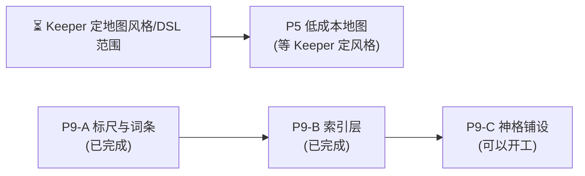

# update_plan/ — Status Tracker

改动计划的索引与执行指引。**执行任何计划前先读本文件**;完成一步就回来更新状态。

## 状态索引

只列**未完成**的计划。已完成并归档的计划不在本表出现,索引见
[Archived/README.md](Archived/README.md)。

| # | 计划 | 范围 | 状态 | 阻塞/等待 |
|---|---|---|---|---|
| P5 | [low-cost-maps](2026-08-02-low-cost-maps.md) | 低成本地图:mermaid 关系图 + DSL→SVG 平面图渲染器 + 手绘要点清单 | 阻塞(等 Keeper 定视觉风格与 DSL 范围) | 三个待拍板问题见计划文件;原型尚未落盘 |
| P9 | [monster-templates-traits](2026-08-02-monster-templates-traits.md) | 怪物侧强度标尺:五级阶梯的档位区间、按 malleus 四类重排的 type、数值词条(强化)系统与其负载预算 | 进行中(阶段 A + B 已完成 059ba63,阶段 C 待开始) | **阶段 A+B 均已交付**:`reference/rules/monster-scale.md`/`monster-traits.md`(阶段 A)+ `reference/tables/monster-index.md`(阶段 B,由扩过的 `build-reference-index.py` 从转录稿 + 人写的 `monster-index-data.json` + 现有 9 只 bestiary 条目合并生成,进 bundle)——**ChatGPT 链路第一次能查到怪物**。现有 9 只已按新标尺重标(2 处 threat 改判、1 处 type 改判),`cthulhu.md` 补了反向眷族小节,`core/07`/`core/04` 已接检索入口。**下一步是阶段 C(神格铺设)**:约 6 个新神格 + 8–10 眷族——kit 现在几乎是克苏鲁专用(克苏鲁提及 135 次,哈斯塔 **0** 次),阶段 A/B 的标尺与索引机制已就绪,无等待项。 |

**状态取值:** `待讨论(<待定什么>)` / `待执行` / `进行中(<当前所在步骤>)` / `阻塞(<等什么>)` /
`已完成(<commit>)`(完结后移除本表,见完结清单第 7 项)

`待讨论` 用于只摆事实、列选项、提问题,尚未产出 `- [ ]` 执行清单的计划——它没有条目可勾,
定案后先补执行清单再转 `待执行`。

条目级进度看各计划文件内的 `- [ ]` 复选框——本表只跟踪计划级状态,不重复条目。

## 依赖图

P9 原有的两条 Keeper 依赖(来源红线、malleus 转录稿)均已解除——红线已在
2026-08-03 定案(可抄录:数值可转、描述自己总结),转录稿已在同日交付。
**P9 现在没有任何等待项**,只剩 P5 还在等 Keeper。

**P1(克苏鲁教团文档整合)已全部完成并归档**(阶段 0-2 见
[`cult-doc-integration`](Archived/2026-08-02-cult-doc-integration.md),阶段 3 收尾见
[`cult-doc-wrapup`](Archived/2026-08-02-cult-doc-wrapup.md),详情见
[Archived/README.md](Archived/README.md))。P9 不是任何硬前置——`core/07` 的占位句
已落盘。

## 建议执行顺序

**P9 阶段 A + B 已完成,阶段 C 现在可以直接开工**,P5 仍等 Keeper 定风格/范围。

1. ~~**P9 阶段 A(标尺与词条)**~~ — **已完成**(2026-08-03 第七轮)。
   `core/07` 那个占位的 X 已补完
2. ~~**P9 阶段 B(索引层)**~~ — **已完成**(2026-08-03,等提交)。
   `reference/tables/monster-index.md` 落盘并进 bundle,ChatGPT 链路第一次能看到怪物
3. **P9 阶段 C(神格铺设)** — 等 A+B(现已解除),且**完全依赖转录稿**(神格数据出自这本书,
   转录稿已交付)。交付后"黄衣之王的精英怪是什么"才真正跑得通
4. **P5 地图** — 仍等 Keeper 定视觉风格/DSL 范围后定稿惯例;若 Keeper 用手绘,
   可只保留 mermaid 一档、砍掉渲染器

**一次只做一个阶段**,每阶段独立走一遍完结清单(体例照 P1);三个阶段全完成后才归档。

## 复杂度排序(从简单到复杂)

上面的「建议执行顺序」按**依赖**排,本表按**工作量**排。**新开窗口从本表第 1 条往下挑**——
挑第一个「现在能动」为「是」的,能在一个上下文里做完并走完完结清单,不必先加载整条依赖链。

| # | 计划 | 复杂度 | 工作量实测 | 为什么是这个档 | 现在能动 |
|---|---|---|---|---|---|
| 1 | ~~**P9 阶段 A** 标尺与词条~~ | ★★★☆☆ | 2 个新建 + 6 处接线 | **已完成**(2026-08-03 第七轮) | ✅ 已完成 |
| 2 | ~~**P9 阶段 B** 索引层~~ | ★★★★☆ | 改 1 个脚本 + 2 个新增(`monster-index.md` 生成物 + `monster-index-data.json` 数据源)+ 回改 9 只 + 3 处接线 + 人写 223 条 `Serves`/摘要 | **已完成**(2026-08-03)——机制与内容在同一会话做完,内容部分靠 8 个并行 subagent 分块读原文起草,没有按原计划拆两个上下文 | ✅ 已完成 |
| 3 | **P9 阶段 C** 神格铺设 | ★★★★☆ | 约 6 个神格 + 8–10 只眷族 = 14+ 个新文件 | **纯内容写作量**,复杂度不高但体量大,且每只都要过阶段 A 的标尺、每个神格都要补阶段 B 定下的「眷族与仆从」小节。kit 现在几乎是克苏鲁专用,这一阶段是拓宽而非补漏 | ✅ 现在能动(A+B 均已解除) |
| 4 | **P5** 低成本地图 | ★★★★☆ | 新写 `scripts/render-map.py` + 原型验证 + 2 个模板 + 2 个 core 各加一行 | 唯一要**从零写渲染器**的计划,且成品好坏得肉眼看 SVG 才知道,迭代成本高。视觉风格没定就写等于白写。**若 Keeper 砍掉 DSL 只留 mermaid,它立刻掉到 ★☆** | ❌ 等风格/范围定案 |

**读法**:★ 数看的是「一个新窗口从零上手到能提交」的总成本——阅读量、决策量、
文件数、能否当场验证,四项合起来。它和「重要性」无关。

**两条经验**(从本表的形状读出来的):

- **能当场验证的排前面。**
- **待讨论的计划,复杂度看"决策"不看"实现"。** 

## 执行守则

- **一次只把一个计划标为"进行中"**,避免半成品互相踩(P1 逐章确认的等待期
  可以插做无依赖项,插做时状态写明:如"进行中(等 Keeper 确认第二章;插做 P6)")
- 每完成计划内一个条目:勾掉该计划文件里的 `- [ ]`
- 每完成一个阶段/整个计划:走一遍下面的**完结清单**
- 收尾在**每个计划完结时**做,不留到最后一起
- 新计划:新建 `YYYY-MM-DD-<slug>.md`,本表加一行,依赖图补节点

## 完结清单(Definition of Done)

**每个计划完结时逐条走完再提交。** 漏项的典型后果:归档文件头还写着"待执行"
(2026-08-02 P2 就是这么漏的)、`dist/bundle.md` 与 `core/` 不同步、
ChatGPT 用户拿到旧规则。

### 1. 状态同步(两处,必须一致)

- [ ] 计划文件头的 `> 状态:` 改成 `**已完成(<commit>)**`,阻塞项写清等什么
- [ ] 本文件状态索引表的「状态」列同步,填 commit hash
- [ ] 计划内所有 `- [ ]` 勾掉;**没做的条目不许勾**——要么写明放弃原因,
      要么拆成新计划并在索引表加行

### 2. Changelog

- [ ] 在根 `CHANGELOG.md` 记一条(格式见该文件顶部)。写**面向 Keeper 的变化**
      ——"现在能做什么/必须怎么做",不是"改了哪个文件哪行"
- [ ] **当天已有条目就补进那一条**(在 `### 修复问题` / `### 更新内容` 下各加一句话、
      标题追加 commit),不要为同一天新开一条
- [ ] 改动影响到根 `README.md` 的入口说明(快速开始、流程图、技能表)时一并更新

### 3. 产物重建

- [ ] 动过 `core/`、`templates/`、`reference/` → 重跑 `scripts/build-bundle.sh`,
      `dist/bundle.md` 与源文件**同一个 commit** 提交
- [ ] 动过 `templates/investigator.schema.json` → 重跑 `scripts/render-investigator.py`
      验证卡面还能渲染
- [ ] 动过 `reference/decks/`、`reference/sourcebooks/`(增删改归档件或其引用出处)→
      重跑 `python scripts/build-reference-index.py`,**必须报 no problems**;
      报「orphaned」说明归档件没接进任何 spec,先接线再提交(见 `core/14-archive-reference.md`)
- [ ] 改动了目录结构、硬约定或计划状态 → 更新 `WORKLOG.md`(给接手会话的上手速览)

### 4. 三适配器一致性

- [ ] 行为改动只落在 `core/`;**根适配器不放独有指令**
- [ ] 确需改适配器时,`CLAUDE.md` / `GEMINI.md` / `AGENTS.md` **三份同步改**
      ——只改一份是 bug,另两个模型不会照做
- [ ] 新增/更名技能:`.claude/skills/<name>/SKILL.md` 与 `CLAUDE.md` 技能表两处都改

### 5. 术语与语言

- [ ] 引入新的规则术语 → 进 `reference/glossary-zh.md`
- [ ] kit 脚手架与文件名保持英文;中文只出现在生成内容与本目录的计划文档

### 6. 计划间关系

- [ ] 本计划**解锁**的下游节点:在依赖图里去掉箭头,被解锁的计划状态从
      `阻塞` 改回 `待执行`
- [ ] 本计划暴露的新问题 → 新建计划文件,别塞进已完结的计划

### 7. 提交与归档

- [ ] commit 信息与 changelog 条目对得上;拿到 hash 后**回填**状态表和计划文件头
      (hash 是提交后才有的,这两处必然是二次提交或 amend)
- [ ] 整个计划(不是单个阶段)完结后,把文件移进 `Archived/`;**本文件状态索引表
      对应行整行删除**(只列未完成的计划),范围描述挪进 `Archived/README.md`
      并加一行索引——细节别留在本文件
- [ ] 提交前 `git status` 确认没有漏掉 `dist/` 或 `.claude/` 下的联动改动

## 已完成归档

计划全部完成后把状态标 `已完成(<commit>)`,移动至 `update_plan/Archived/`,
作为设计决定的记录(各计划内含"为什么这样做"的备忘)。
**归档不等于完结**——先走完上面的完结清单,最后一步才是移动文件。

**归档计划的范围描述、设计理由等细节记在 [`Archived/README.md`](Archived/README.md),
不在本文件重复。** 本文件的状态索引表**只列未完成的计划**,归档条目整行删除
——理由是归档计划只会越来越多,留着指针行也会让每次读本文件的 token 成本一直涨。
新增归档时,除了走上面的完结清单,还要在 `Archived/README.md` 加一行索引。
